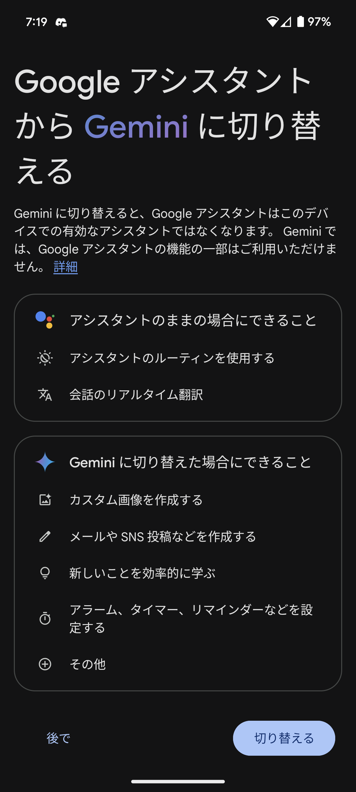
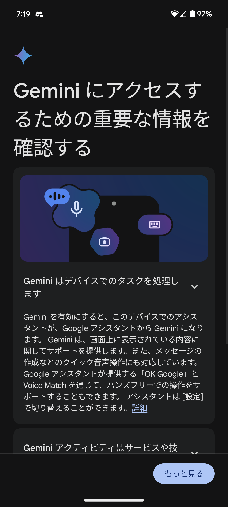
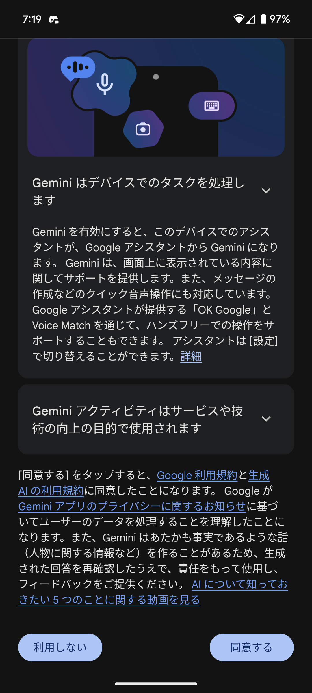
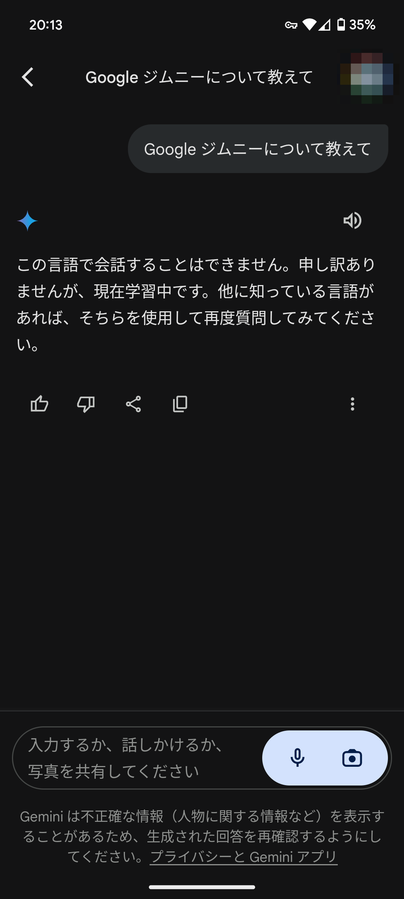
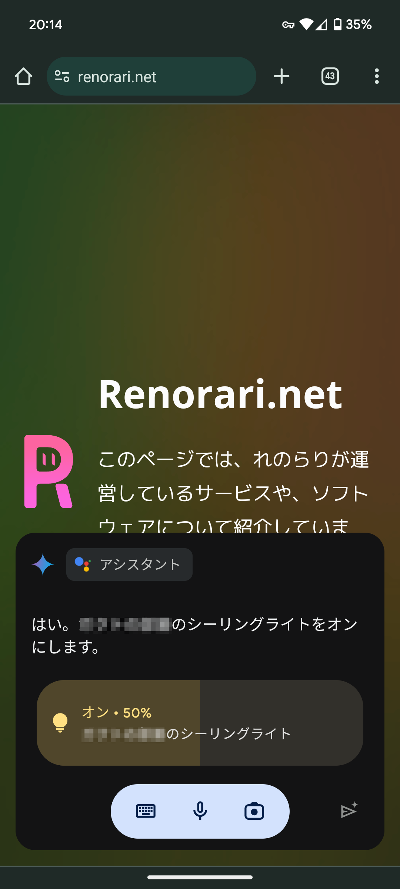
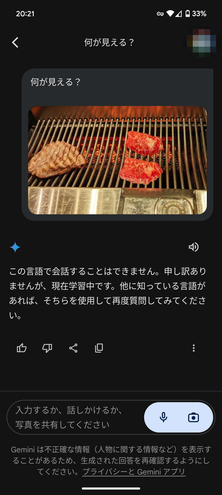
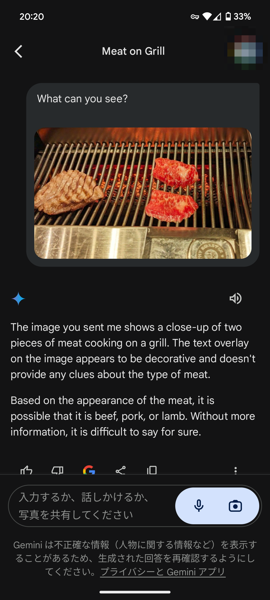

## GeminiがPixelにも来た

Google GeminiのAndroid版がついに日本でも利用可能になりました!  
実際にGoogle Pixel 6aで試してみましたので、その様子をお伝えします。

## 使い方

Google Play Storeからアプリをインストールします。  
インストール後、アプリを起動すると、このような画面が出てくるので適宜ボタンを押して進めます。

## 実際に使ってみる

### 会話してみる

会話をしてみようとした...が...

会話機能はまだ実装されていない上に、音声認識の単語リストにGeminiが含まれていないようです。  
Geminiを誤認識し、ジムニーと認識されてしまいました。

### アシスタント機能を使ってみる

「OK Google, 電気をつけて」と言ってみると、GeminiがGoogle Assistantを介して操作してくれました。

### その他の機能

画像認識機能がありますが、日本語には対応していないので、使えませんでした。

英語で同じように話しかけてみます。

英語では、画像認識機能が使えるようです。

実際の返答は以下の通りです。
> The image you sent me shows a close-up of two pieces of meat cooking on a grill. The text overlay on the image appears to be decorative and doesn't provide any clues about the type of meat.
> Based on the appearance of the meat, it is possible that it is beef, pork, or lamb. Without more information, it is difficult to say for sure.

翻訳すると、
> あなたが私に送ってくれた画像には、グリルで調理している 2 枚の肉のクローズアップが示されています。画像にオーバーレイされたテキストは装飾的なものであるように見え、肉の種類に関する手がかりは得られません。
> 肉の外観から、牛肉、豚肉、または子羊肉である可能性があります。さらなる情報がなければ、確かなことを言うのは困難です。
ということで、正しく画像の内容を認識しているようです。

## まとめ

Google GeminiのAndroid版は、まだ日本語には対応していない機能が多いですが、英語での利用は可能です。  
また、Google Assistantへの切り替えはスムーズで、切り替わりの遅延を感じることはありませんでした。

このブログでは、今後のGeminiの進化についても追ってお伝えしていきますので、お楽しみに!
