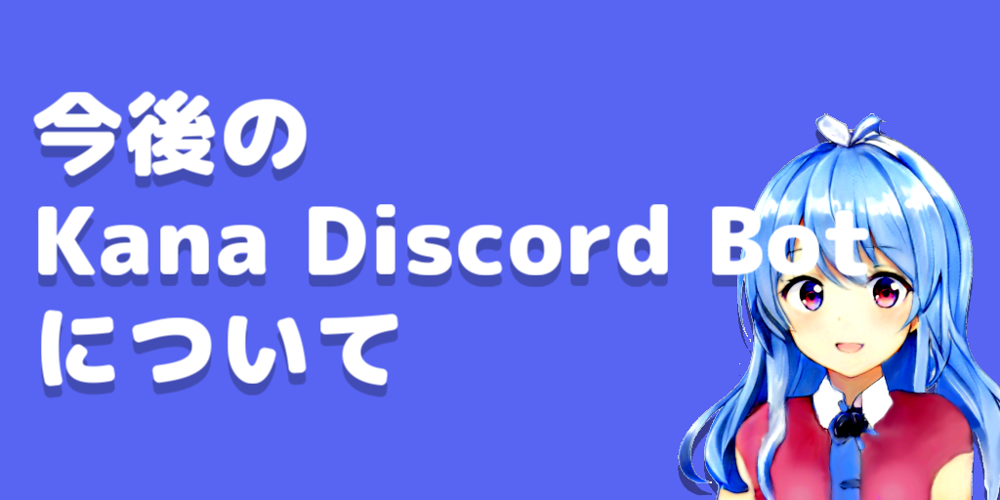

## 注意

この記事の内容は、撤回されました。

## はじめに

こんにちは、れのらりです。

この記事では、Kana Discord Botの今後について書いていきます。

## 今の状況

現在、Kana Discord Botは、Kanaのバージョン2で動いています。

Kanaのバージョン2は、これ以上の機能追加が困難な状況になっています。

そのため、Kana Discord Botの新機能や改善ができていません。

## 今後の予定

今後の予定として、Kana Discord BotをKanaのバージョン3に移行することを考えています。

それに伴い、Kana Discord Botの全機能のリセット及び、Kana Discord Botのデータベースのリセットを行う予定です。

Kana Discord Botのデータベースのリセットにより、Kana Discord Botのデータベースに保存されているデータは全て削除されます。

また、機能のリセットにより、Kana Discord Botの機能は全て削除されます。

## データ・機能の移行について

Kana Discord Botのデータ・機能の移行については、以下のように行う予定です。

### データの移行

Kana Discord Botのデータベースのデータは、全て削除されます。

該当のデータは以下のとおりです。

- UGCのルール同意確認
- サーバー検索の招待リンクの表示許可
- YouTube通知機能(ベータ版)の使用許可
- サーバーガードの無効化
- グローバルチャットのチャンネル
- YouTube通知機能(ベータ版)の設定

### 機能の移行

Kanaの継続的な機能の移行は、以下のとおりです。

#### 各種認証機能

認証機能に関するデータは、TakasumiBOTへ移行することができます。

認証機能の移行については、別記の記事でお知らせします。

## おわりに

以上、Kana Discord Botの今後についてでした。

長らくKanaをご愛用いただき、ありがとうございました。

Kanaは、2024年をめどに、生まれ変わったKanaとして、再び皆様のもとへ復帰する予定です。

今後とも、Kanaをよろしくお願いいたします。
