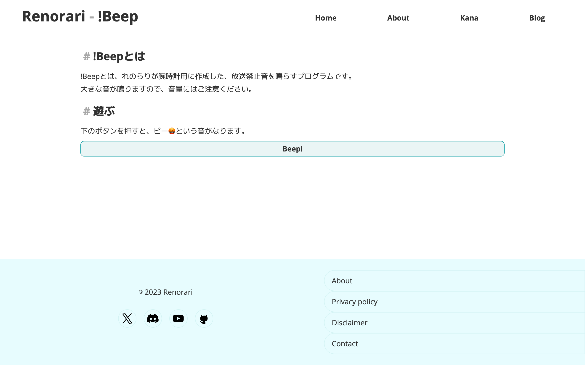

## !Beepとは?

!Beepとは、れのらりが腕時計用に作成した、放送禁止音を鳴らすプログラムです。  
学校で使うためだけに作りました。(はい。)

## 使い方

### !Beepを開く

[https://renorari.net/tools/beep.html](https://renorari.net/tools/beep.html)
にアクセスします。

そうすると、このようになります。

### Beep!ボタンを押す

音を鳴らすには、\[Beep!\]ボタンを押します。

そうすると、放送禁止音が鳴ります!

## 終わり

いかがでしたか?  
とっても簡単にできましたね!

れのらりBlogでは、他のツールについても解説していきますので、応援の程よろしくお願いします!
