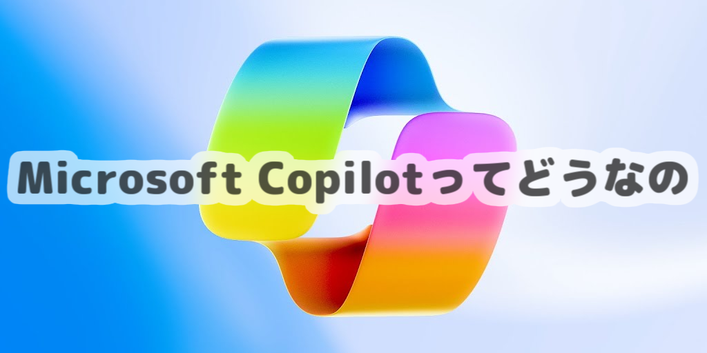
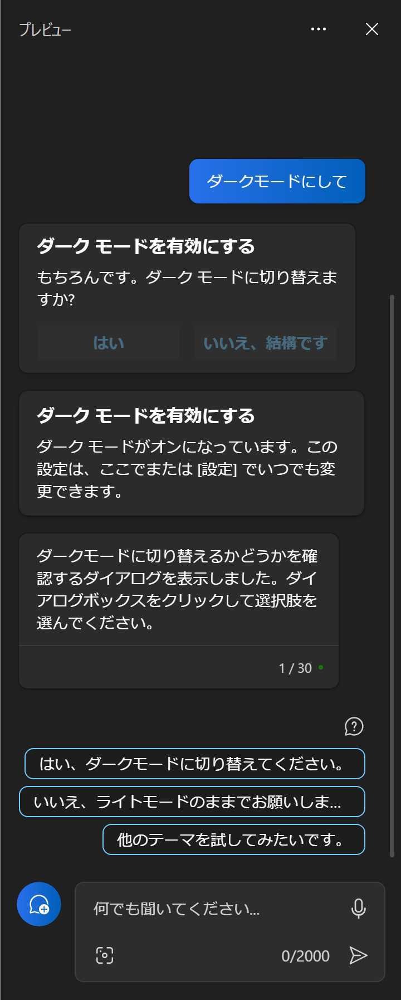
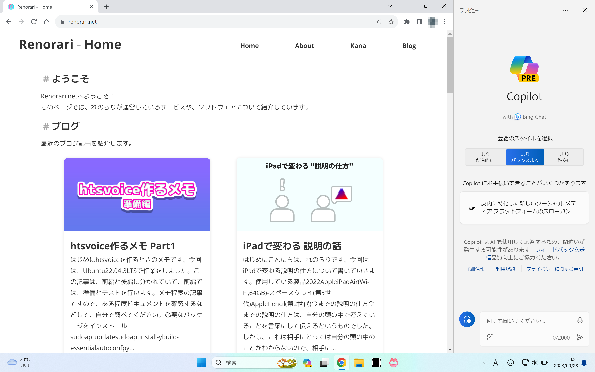

## Microsoft Copilotとは

Microsoft Copilotは、Microsoftが開発したAI支援ツールです。  
対話形式のAIで、操作がわからないときに、AIが教えてくれます。

例えば、画面を黒を基調としたダークモードにしたいときに、  
「ダークモードにして」というと、ダークモードに変更するボタンが出てきます。

このように、AIが操作を教えてくれるので、操作がわからないときに便利です。  
このウインドウは、特別なウインドウになっていて、  
Copilotを使用しているときは、他のウインドウの表示領域の上に表示することなく、  
画面右側に表示されます。

CopilotはBingAIを使用していますが、ブラウザ版では最大5回までのチャットですが、  
Windows版では600%の30回まで使用可能です。

## 使い方

Copilotは、Windows11の22H2で使用可能です。  
Windows11の22H2にアップデートした後、タスクバーにCopilotのアイコンが表示されます。  
アイコンをクリックすると、Copilotが起動します。  
Bing Chatを使用しているので、簡単に使うことができます。

## 使った所感

Copilotによって、操作がわからないときに、AIが教えてくれるので、初心者には便利です。  
ですが、日本語の学習が不十分なのか、英語と日本語で同じ指示をしても、日本語では目的の動作をしてくれないことがあります。  
また、Copilotは画面が見えているわけではなく、チャットに送った画像や文章から応答しているので、画面の文章を要約するなどの機能はないです。

Copilotのウインドウは、他のウインドウの表示領域の上に表示することなく表示するので、Windowsとの一体感があります。  
これは、今までにはなかったもので、Windowsはよりナチュラルになっていると思います。  

## まとめ

- Microsoft Copilotは、Microsoftが開発したAI支援ツール
- 最新バージョンのWindowsのみで使用可能
- 操作がわからないときに、AIが教えてくれるので、初心者には便利
- 日本語は若干不自由
- 画面の文章を要約するなどの機能は(まだ)ない
- Windowsとの一体感がある

ということで、Microsoft Copilotを使った所感でした。  
れのらりブログでは、他の技術系の記事も書いているので、ぜひご覧ください!