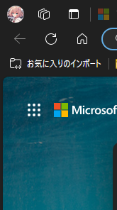

## 100vwは危険

最近のMicrosoft Edgeのアップデートにより、表示領域の縁が太くなりました。  
ですが、CSSで100vwを指定すると、表示領域の縁の分も含まれてしまいます。  
そのため、スクロールバーが表示されてしまいます。



## 解決策

100vwを使用せずに、100%のみで指定することで、スクロールバーが表示されなくなります。

```css
width: 100%;
```

## まとめ

- Microsoft Edgeのアップデートにより、表示領域の縁が太くなった
- 100vwを使用すると、表示領域の縁の分も含まれてしまう
- 100%のみで指定することで、スクロールバーが表示されなくなる

やっぱりMicrosoft Edgeはクソです。  
IE系ではないだけマシなだけで、やっぱりやらかしているMicrosoft Edge。  
Microsoft Edgeは、Chromium(Chromeのオープンソース版)を使用しているはずなのに、ガラパゴス仕様を盛り込むという、Microsoftらしい仕様です。  
ふざけんな。  
以上!
