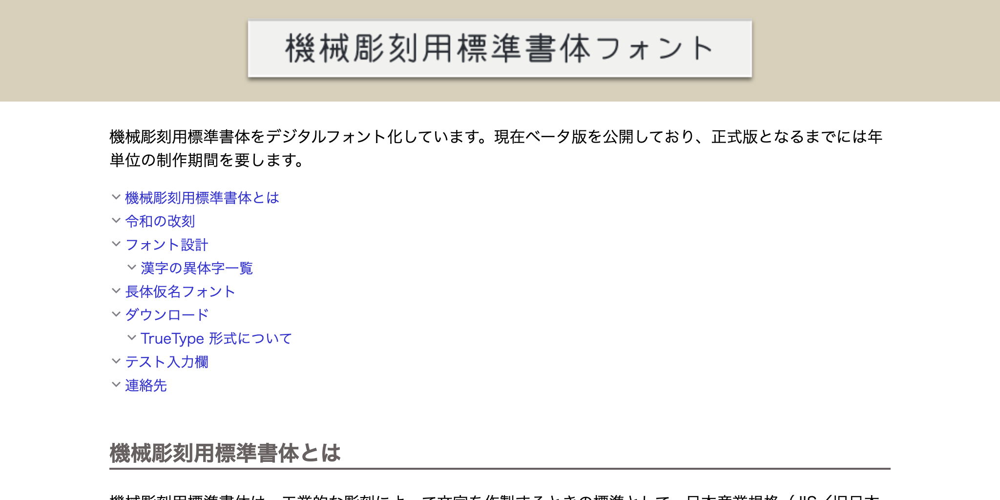
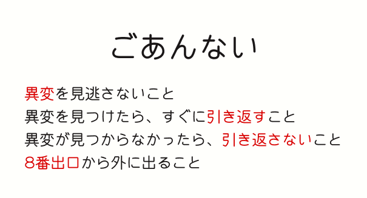
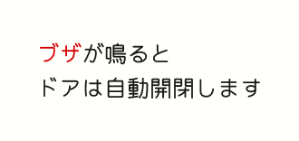
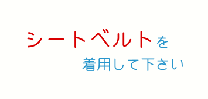

フリーフォントで遊ぼうシリーズ第一回は、機械彫刻用標準書体フォントです。  
機械彫刻用標準書体は、工業的な彫刻によって文字を作製するときの標準として、日本産業規格（JIS／旧日本工業規格）に定められた書体です。  
工業彫刻における技術的制約から、独特な機能美を持つ書体となっています。  

そんな機械彫刻用標準書体を、フリーフォントとして配布しているサイトを紹介します。

## 配布サイト

[機械彫刻用標準書体フォント](https://font.kim/#download)

## フォントの特徴

機械彫刻用標準書体フォントは、以下の特徴を持っています。

- JIS Z 8301をもとにした、レトロで機械的な印象の書体
- 文字の形状は、彫刻機械で加工したかのような、直線的な形状
- 文字の太さは均一で、角は丸くなっている

## フォントの使用例

機械彫刻用標準書体フォントは、工業的なデザインや、レトロな印象を与えたいときに最適です。
以下は、使用例です。

## まとめ

機械彫刻用標準書体フォントは、工業的なデザインやレトロな印象を与えたいときに最適なフォントです。
フリーフォントとして配布されているので、気軽に使用することができます。  
ぜひ、試してみてください。  
機械彫刻用標準書体フォントを使用して、あなたのデザインに独特な印象を与えてみてはいかがでしょうか。  

フリーフォントで遊ぼうシリーズは、今後も続けていく予定です。
次回は、別のフリーフォントを紹介しますので、お楽しみに！

## 参考リンク

- [機械彫刻用標準書体フォント](https://font.kim/#download)
