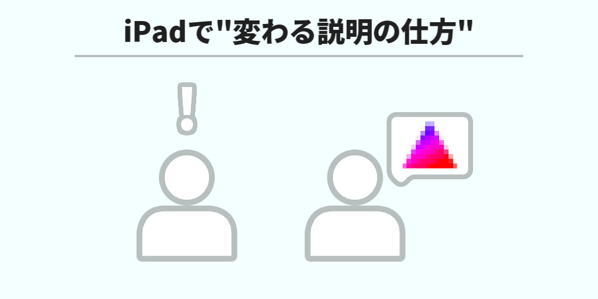
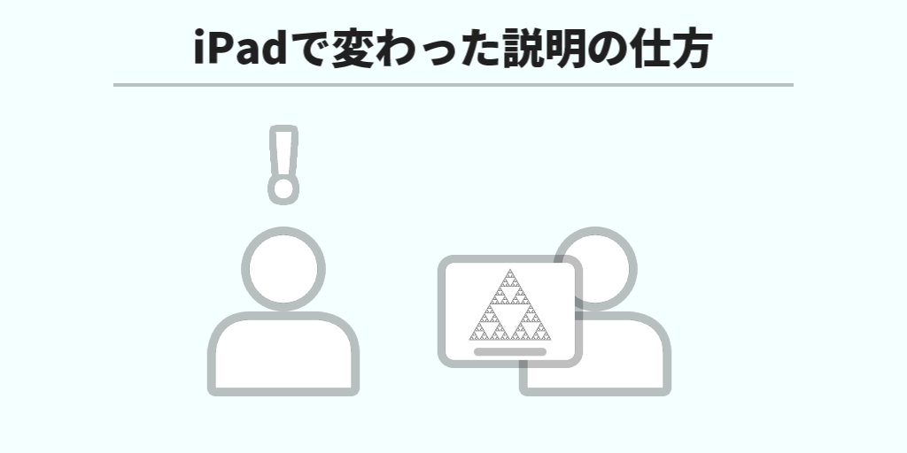

​

## はじめに

こんにちは、れのらりです。  
今回はiPadで変わる説明の仕方について書いていきます。  

## 使用している製品

- [2022 Apple iPad Air (Wi-Fi, 64GB) - スペースグレイ (第5世代)](https://amzn.to/3teRUL2)
- [Apple Pencil(第2世代)](https://amzn.to/3t3Du0q)

## 今までの説明の仕方

今までの説明の仕方は、自分の頭の中で考えていることを言葉にして伝えるというものでした。  
しかし、これは相手にとっては自分の頭の中のことがわからないので、相手にとっては理解しにくいということがありました。

## iPadで変わった説明の仕方

iPadで変わった説明の仕方は、自分の頭の中で考えていることをそのままその場で図にして伝えるというものです。  
これは相手にとっては自分の頭の中のことがわかるので、相手にとっては理解しやすいということがあります。  
また、図を直接指して、相手も話すことができるので、相手も話しやすいということがあります。

## まとめ

iPadで簡単に図を書くことができるので、図を用いた説明をすることができます。  
みなさんもiPadを使って図を用いた説明をしてみてはいかがでしょうか。
