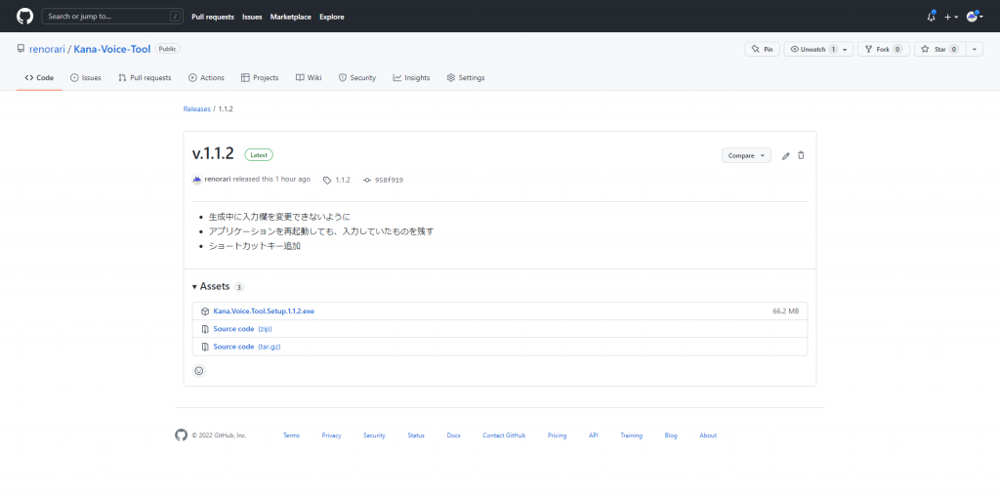
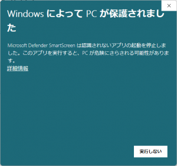
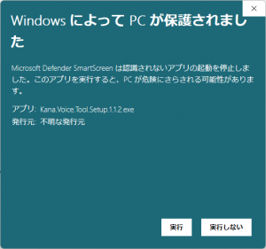
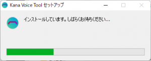
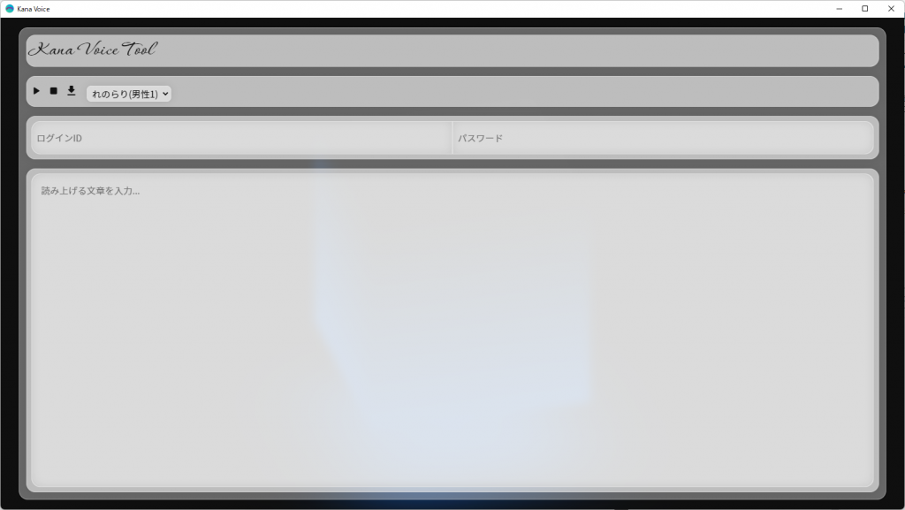

## お知らせ

本記事がYouTube動画になりました!
本記事とは少し違う内容なのでどちらもご覧になって、楽しめたらうれしいです!

https://www.youtube.com/watch?v=ft0CDDRPt38

## KanaVoiceとは

KanaVoiceとは、Kanaサービスの音声合成です。
独特ながら、あらゆる場面で使用可能な音源で大変便利です。

## Kana Voice Toolをインストール

まず、[github.com/renorari/Kana-Voice-Tool/releases/latest](https://github.com/renorari/Kana-Voice-Tool/releases/latest)にアクセスします。

そうすると上の画像のような画面になるので、**Kana.Voice.Tool.Setup.X.X.X.exe**を押します。
押すと、インストーラーがダウンロードされます。

ダウンロードが完了したら、ファイルを開いてください。

このような画面が出た場合は、**詳細情報**を押し、

**実行**を押してください。
そうすると、インストーラーが開かれてインストールされます。

## KanaAPIアカウント作成

KanaAPIアカウントは、KanaVoiceなどを利用するのに必要なものです。

[kana.renorari.net/register.html](https://kana.renorari.net/register.html) を開いて登録を行ってください。

## KanaVoice利用規約を読む

音源を使う前に、[kana.renorari.net/api/voice\_license.md](https://kana.renorari.net/api/voice_license.md)を必ずお読みください。

## Kana Voice Toolを実行

インストールが完了した後、すぐにKana Voice Toolが実行されます。
※実行されない場合は、スタートメニューからKana Voice Toolを実行してください

**ログインID**や**パスワード**の入力欄に、先ほど作成したKanaAPIアカウントのログインIDとパスワードを入力してください。

一番大きな入力欄に試しに「こんにちは。」と入力して、**F5**を押すか上の**再生ボタン**を押してください。
音声が流れたら成功です!

上の「れのらり(男性1)」を押してほかの音源を選択することもできるので、いろいろ試してみてくださいね!

れのらり(男性1)

ササ(男性2)

白音サキ(女性1)
