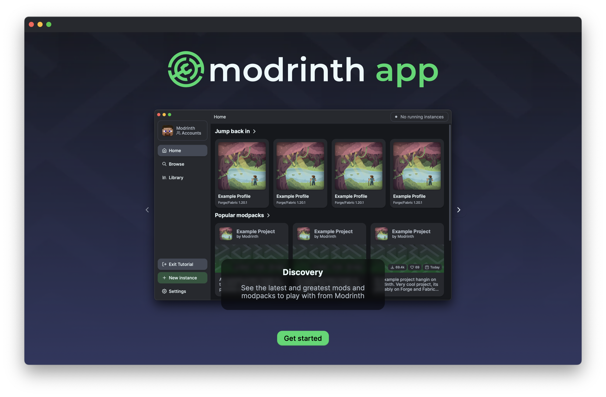
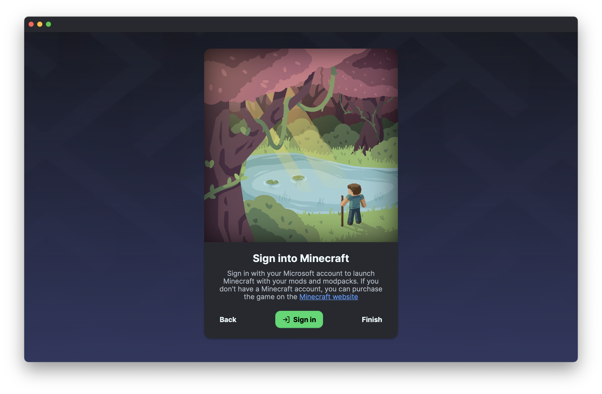
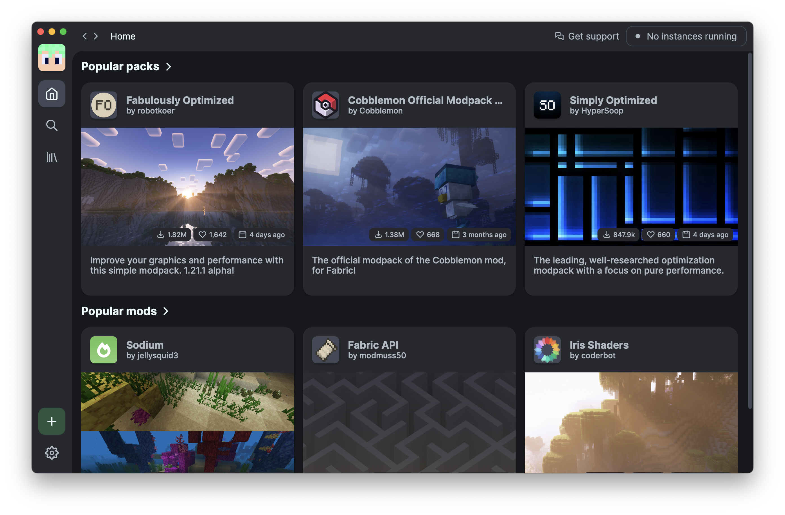
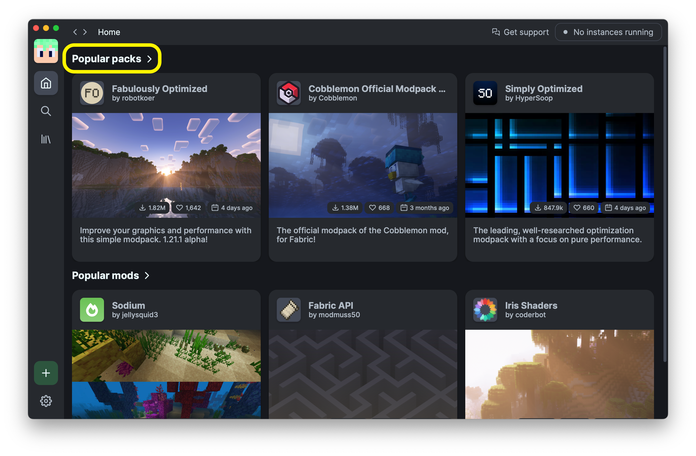
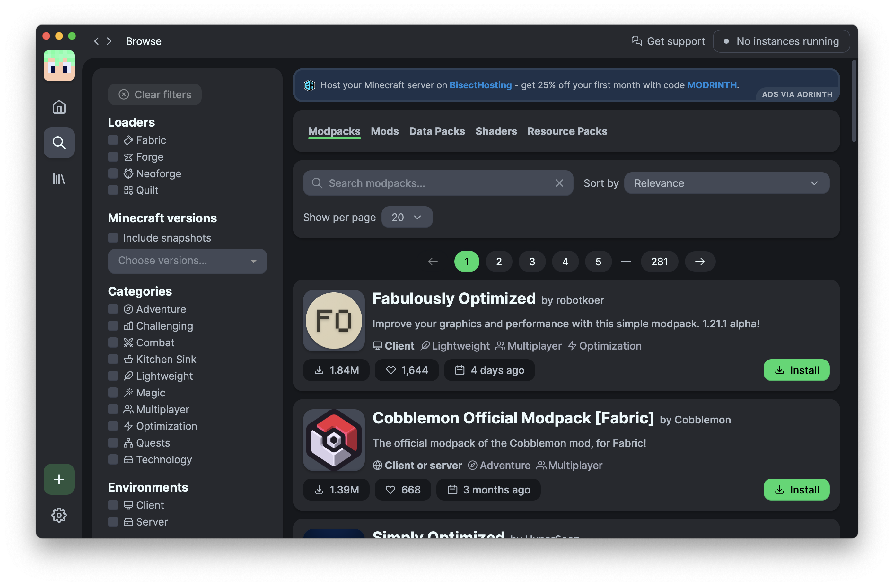
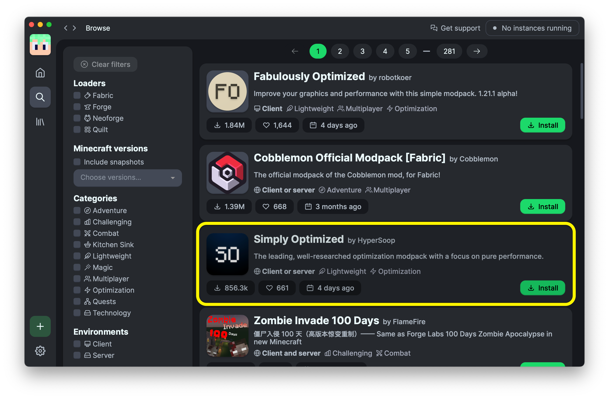
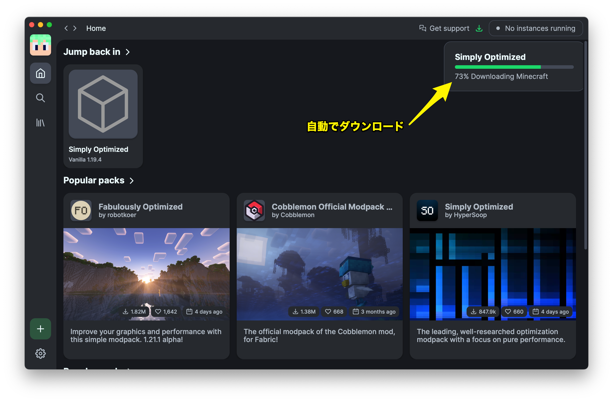
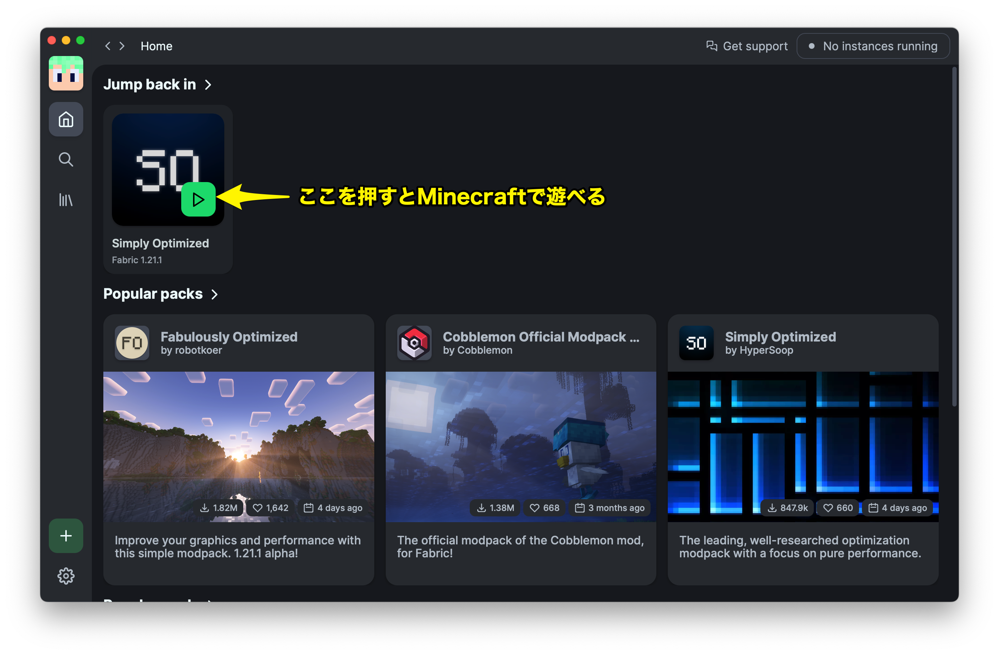
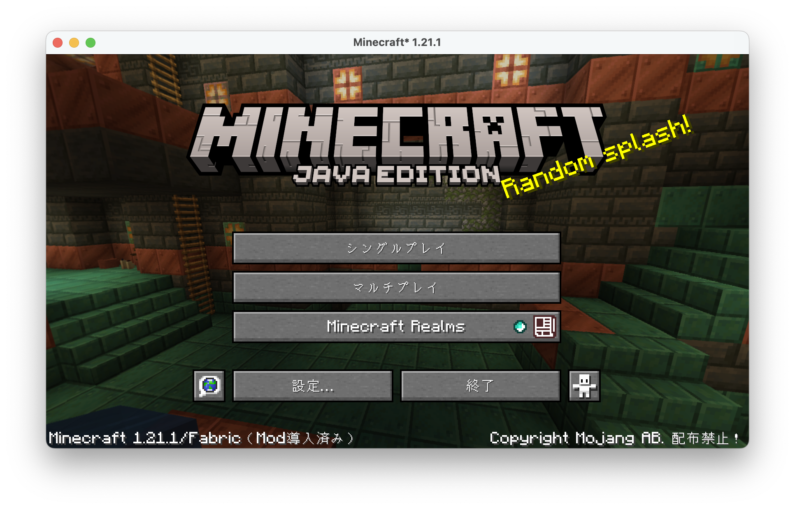

こんにちは！  
Minecraft 6年プレイヤーの私がお勧めする、Minecraftを軽量化するModをまとめてインストールする方法を紹介します。

## 1. Modrinthをインストール

Modrinthは、MinecraftのModを管理するためのアプリです。  
このアプリを使うことで、Modのインストールやアップデートが簡単に行えます。

[Modrinth公式サイト](https://modrinth.com/app)からダウンロードしてインストールしましょう。

## 2. Modrinthを起動

Modrinthを起動すると、上のような画面になるので、下の緑のボタンをクリックして始めましょう。

そうすると、ログイン画面が表示されるので、Minecraftのアカウントでログインしてください。

ログインが終わると、Modrinthのホーム画面が表示されます。

## 3. Modをインストール

ホーム画面の `Popular packs` をクリックすると、人気のModパックが表示されます。

ここでは、`Simply Optimized` というModパックをインストールしてみましょう。  
`Install`ボタンをおすと、Modrinthが自動的にModをダウンロードしてインストールしてくれます。

自動でダウンロードしてくれます。

## 4. 遊ぶ

緑の再生ボタンを押すと、Minecraftが起動し、Modが適用された状態で遊ぶことができます。

## 終わりに

以上で、Minecraftを軽量化するModをまとめてインストールする方法を紹介しました。

Modrinthを使えば、手軽にModを管理できるので、ぜひ活用してみてください！
