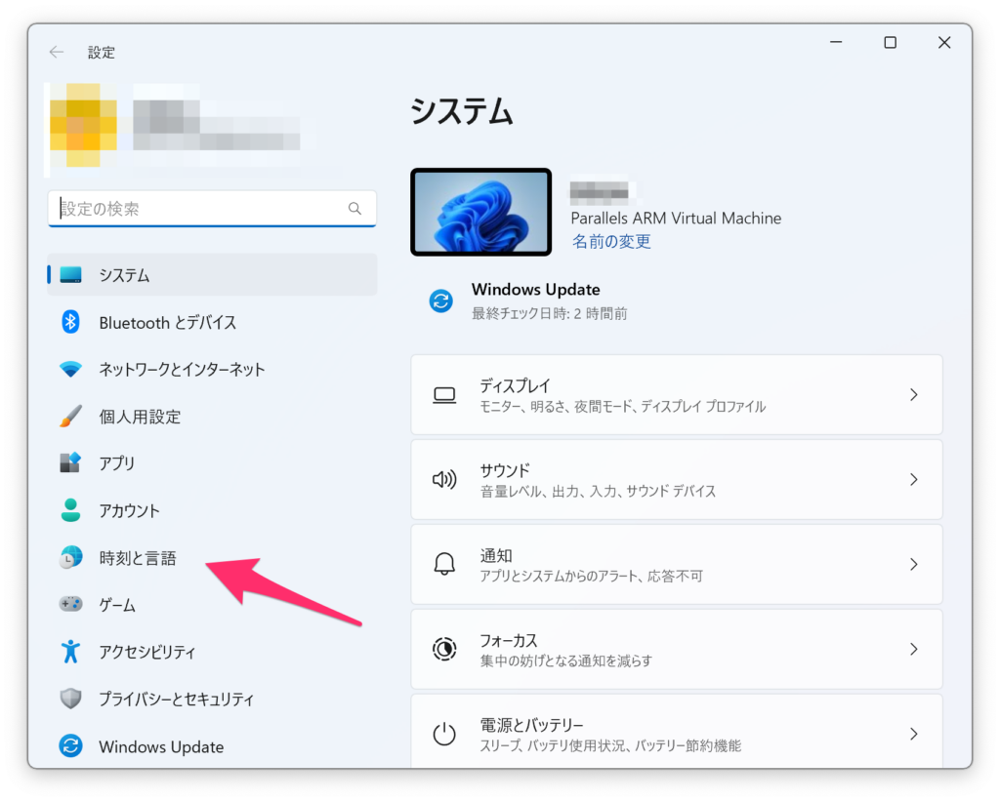
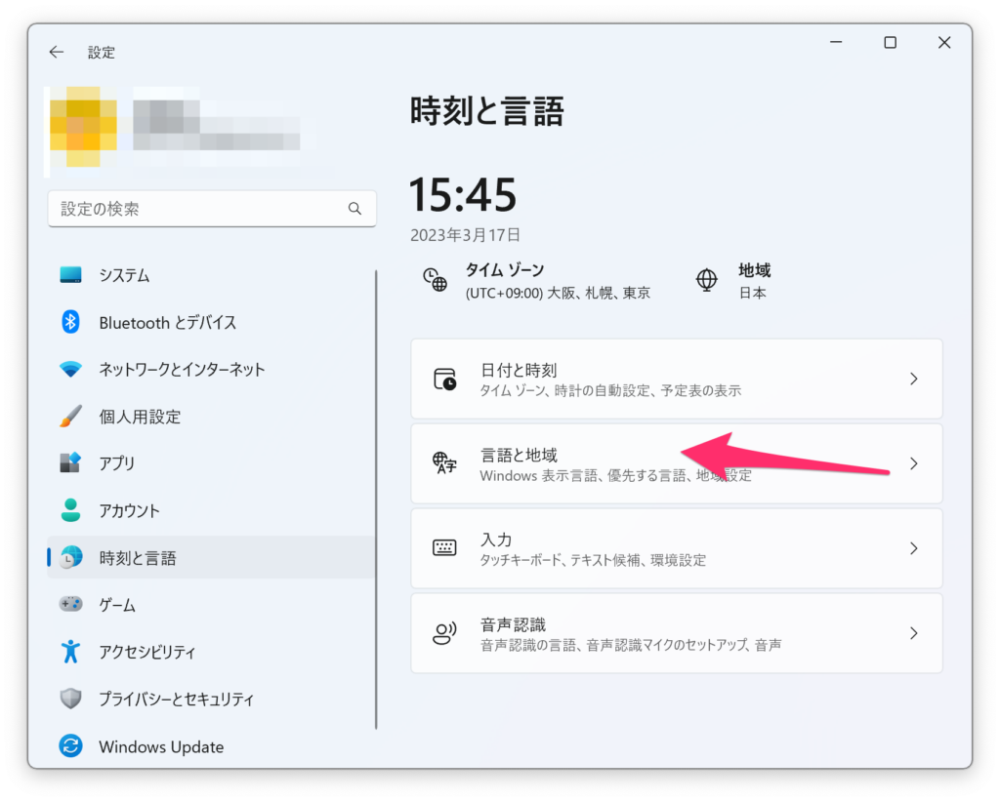
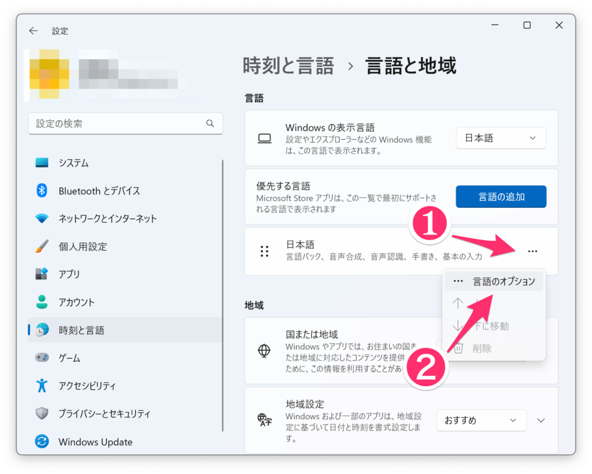
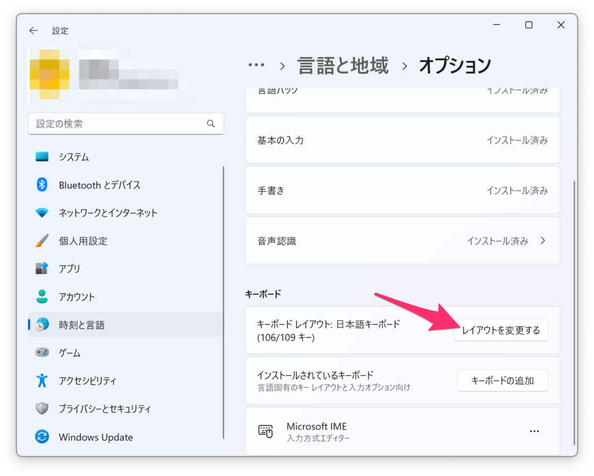
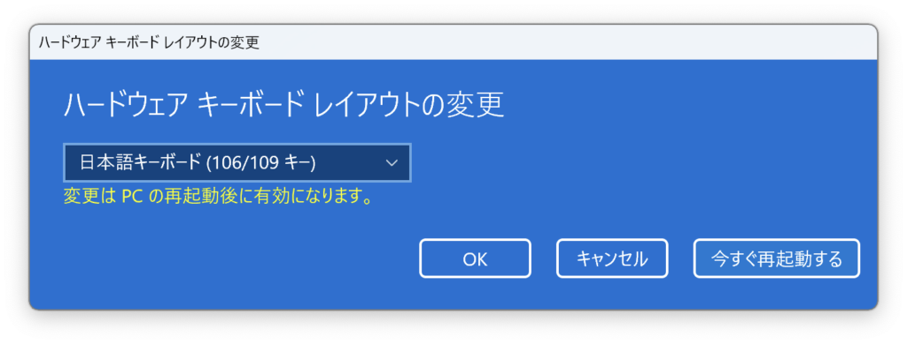
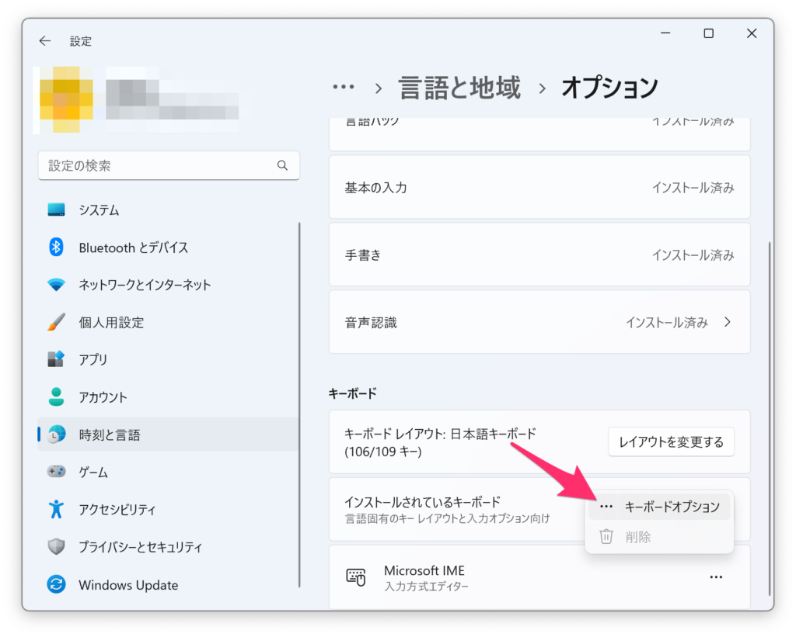
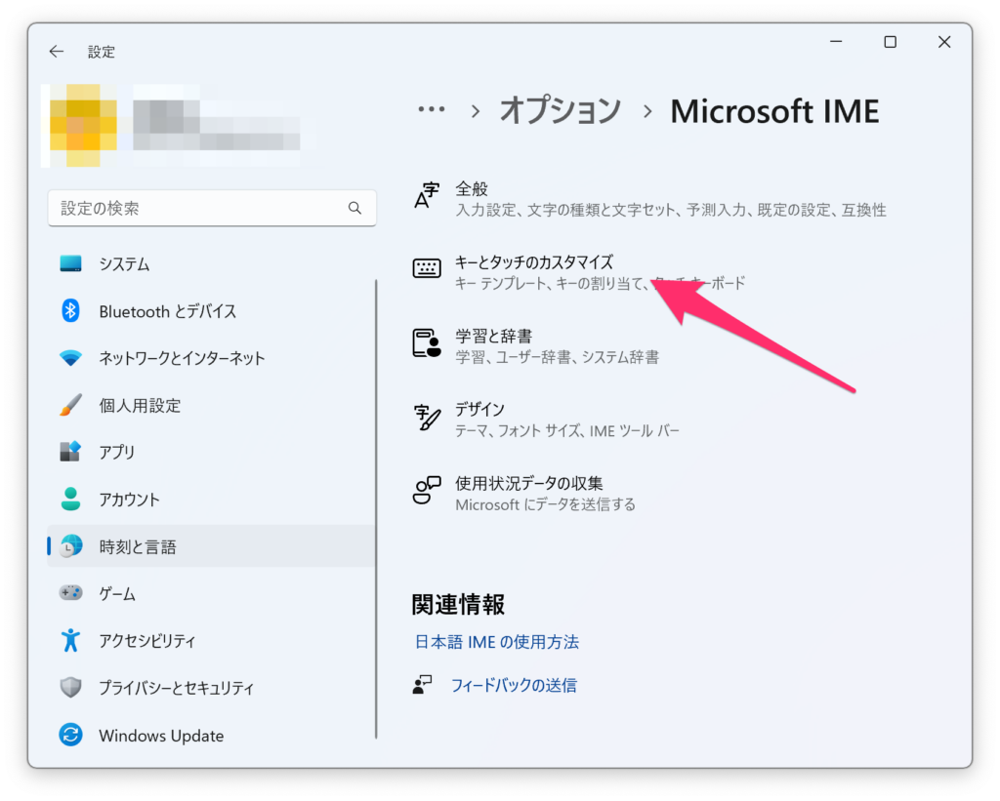
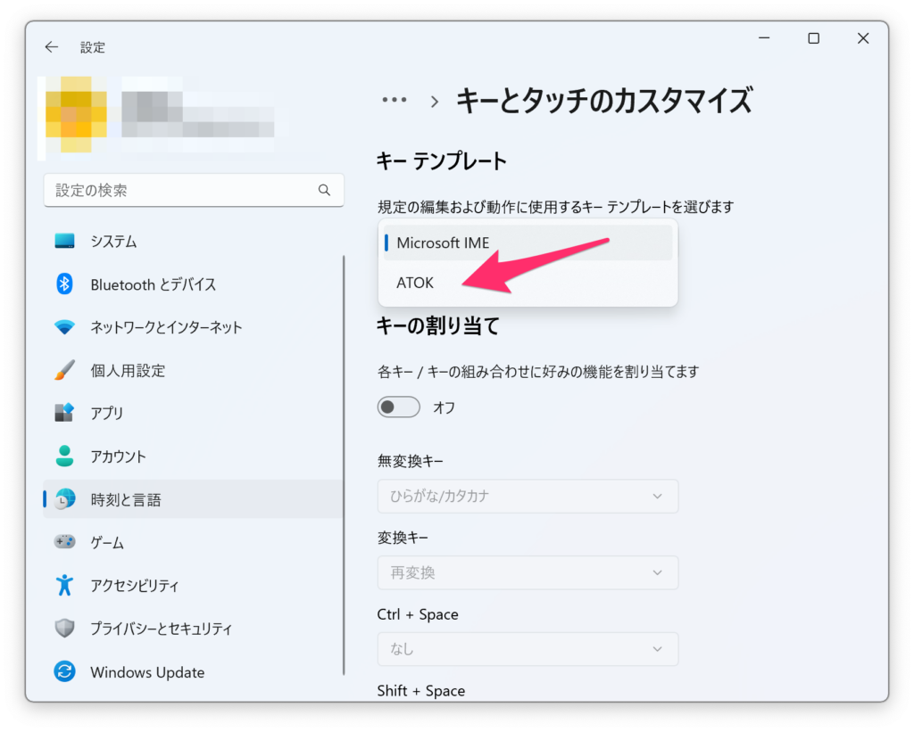

私は、Windows用のソフトウエアを使用するために、Parallels DesktopでWindowsを動かしています。  
そんな中で、日本語入力の切り替えができないことに気がつきました。  
今回は、MacのJIS配列に設定を合わせていきます。

## キーボードレイアウトを設定する

Windowsの設定を開き、時刻と言語を選択します。

Windowsの設定 > 時刻と言語

次に、言語と地域を選択します。

時刻と言語 > 言語と地域

日本語の横の３点リーダーから、言語のオプションを選択します。

日本語 > ３点リーダー > 言語のオプション

キーボードからキーボードレイアウトを探し、レイアウトを変更するを押します。

キーボード > キーボードレイアウト > レイアウトを変更する

\[接続済みキーボード レイアウトを使用する\]から\[日本語キーボード (106/109 キー)\]に変更し、今すぐ再起動する を押します。

ハードウェア キーボード レイアウトの変更

これでキーボードレイアウトが日本語になりました。

## MacのJIS配列に合わせる

まず、設定を開き、言語のオプションに移動します。  
(移動方法は上記と同じ)

Microsoft IMEの３点リーダーを押し、キーボードオプションを選択します。

言語のオプション > Microsoft IME > ３点リーダー > キーボードオプション

キーとタッチのカスタマイズを選択します。

Microsoft IME > キーとタッチのカスタマイズ

キー テンプレートをMicrosoft IMEからATOKへ変更します。

キー テンプレートをMicrosoft IMEからATOKへ

これで、英数キーとかなキーが使えるようになりました。
