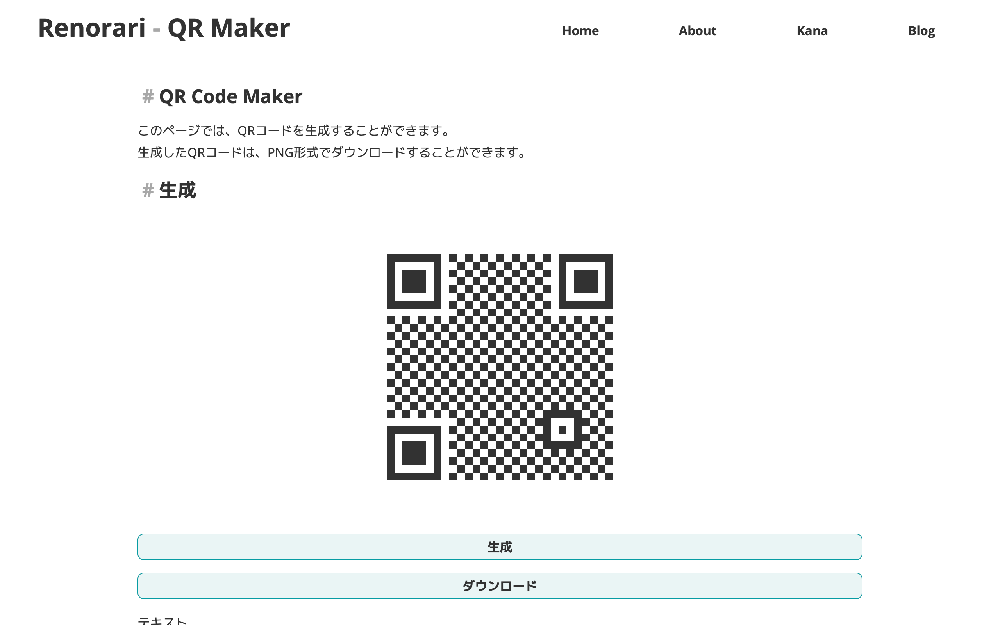

## QR Code Makerとは

れのらりQRコードメーカーは、QRコードを素早く簡単に作成できるウェブアプリです。  
クリップボードから自動でQRコードを生成し、ダウンロードすることができます。

## 使い方

### 1. QRコードメーカーのページを開く

[https://renorari.net/tools/qr.html](https://renorari.net/tools/qr.html)を開きます。  
そうすると、このようになります。

### 2. テキストボックスにQRコードにしたい文字列を入力する

テキストボックスにQRコードにしたい文字列を入力します。  
(クリップボードから自動でQRコードを生成することもできます)

### 3. QRコードを生成する

QRコードを生成するには、\[生成\]ボタンを押します。  
そうすると、生成されたQRコードが画面上部に表示されます。  
また、QRコードの画像をダウンロードすることもできます。

### おまけ

このQRコードメーカーには、サイズやファイルフォーマット、色や誤り訂正レベルなどの設定を変更することができます。  
実際に触って、色々と試してみてください!
