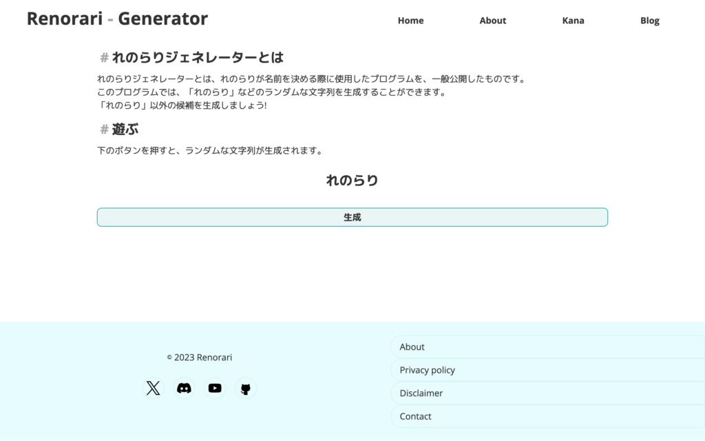

## Renorari Generatorとは?

れのらりジェネレーターとは、れのらりが名前を決める際に使用したプログラムを、一般公開したものです。  
「れのらり」などのランダムな文字列を生成することができます。

このウェブアプリは、renorari.netができた2021年にできた、最古のページです。  
とっても貴重ですよね!

## 使い方

### Renorari Generatorを開く

[https://renorari.net/tools/generator.html](https://renorari.net/tools/generator.html)  
にアクセスします。

そうすると、このようになります。

### 生成ボタンを押す

文字を生成するには、\[生成\]ボタンを押します。  
そうすると、ランダムな4文字のひらがなが生成されます!

## 終わり

いかがでしたか?  
とっても簡単にできましたね!

れのらりBlogでは、他のツールについても解説していきますので、応援の程よろしくお願いします!
