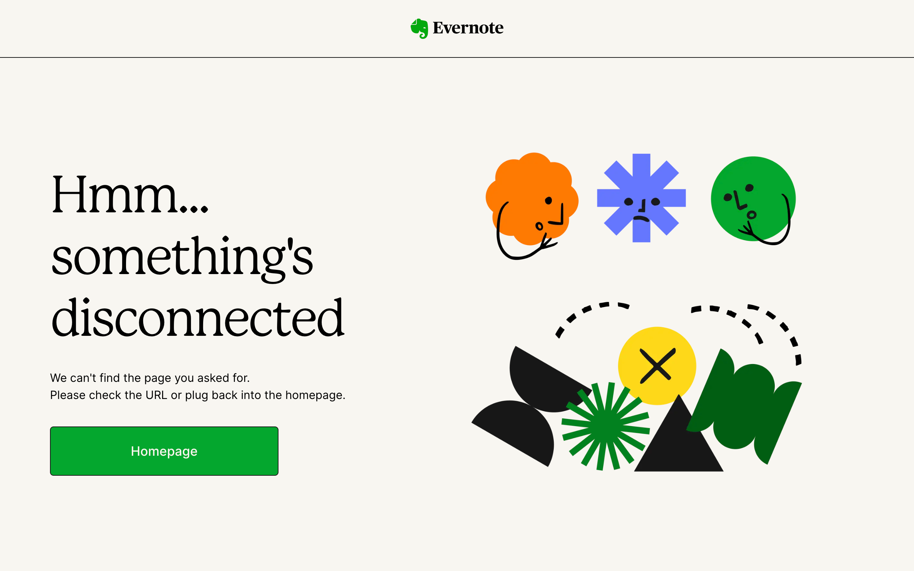
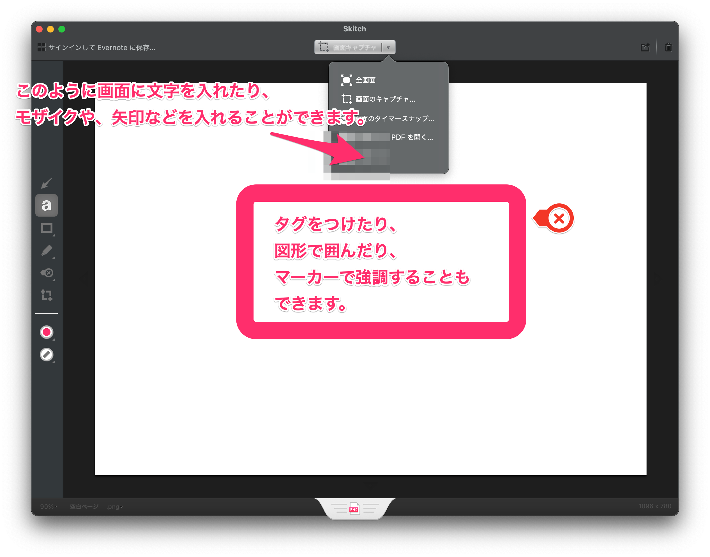

# 大手画像加工ソフトSkitchがサービス終了

Skitch for Macが、App Storeから削除されました。


また、Evernote公式サイトにもSkitchのページがなくなり、Skitchのサービスが終了したことがわかります。



## Skitchとは

Skitchは、Evernoteが提供していた画像加工ソフトです。  
Skitchは、画像に矢印や文字、モザイクなどを追加できるので、画像を加工する際に便利でした。



実は、れのらりブログでは、何度かSkitchを利用しています。
例えば、[Parallels DesktopでWindows11の日本語入力をMacに合わせる方法](https://renorari.net/blog/parallels-desktop%E3%81%A7windows11%E3%81%AE%E6%97%A5%E6%9C%AC%E8%AA%9E%E5%85%A5%E5%8A%9B%E3%82%92mac%E3%81%AB%E5%90%88%E3%82%8F%E3%81%9B%E3%82%8B%E6%96%B9%E6%B3%95/)の画像は全てSkitchで加工しています。

## 代替手段

SkitchのApp Storeからの削除により、Skitchをインストールできなくなりましたが、代替手段があります。

Homebrewを利用して、Skitchをインストールすることができます。

```bash
brew install --cask skitch
```

このコマンドを実行することで、Skitchをインストールすることができ、Skitchを利用することができます。

## まとめ

Skitchがサービス終了となり、App Storeから削除されました。  
しかし、Homebrewを利用することで、Skitchをインストールすることができます。  
皆さんも、Skitchを利用して、手軽に画像加工をしてみてはいかがでしょうか。

れのらりブログでは、技術系の情報を主に発信していますので、ぜひ他の記事もご覧ください!
