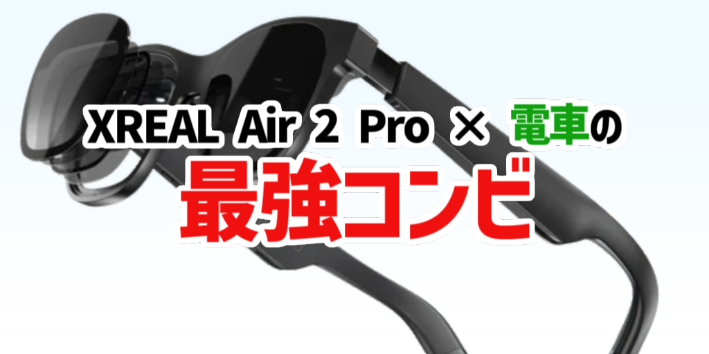

## 初めに

初めに今回使った製品をご紹介します。  
今回使った製品は、MacBook ProとXREAL Air 2 Proです。

### XREAL Air 2 Pro

XREAL Air 2 Proは、XREALが販売しているメガネ型ディスプレイです。  
メガネ型ディスプレイなので、外出先での作業に最適で、電車内でも作業がしやすいです。

[XREAL Air 2 Proのご購入はこちらからどうぞ](https://amzn.to/42NUJ3A)

### MacBook Pro

MacBook Proは、Appleが販売しているノートパソコンです。  
バッテリー持ちが良く、性能も高いので、外出先での作業に最適です。

[MacBook Proの最新モデルはこちらからどうぞ](https://amzn.to/49mN7Yd)

## 電車での作業

今回、初めて電車で長時間移動しましたが、XREAL Air 2 Proを使って作業をすることが快適すぎて、あっという間に時間が過ぎました。  
XREAL Air 2 Proは、メガネ型ディスプレイなので、周りの人にも迷惑をかけずに作業ができますし、電車内の揺れにも強いので、作業中に気分が悪くなることもありませんでした。  
また、スマートフォンやパソコンを長時間使っていると、首や肩が痛くなることがありますが、XREAL Air 2 Proは、メガネ型ディスプレイなので、正面をまっすぐみることができます。  
そして、公共交通機関での作業は、画面を他の人に見られることがありますが、XREAL Air 2 Proは、周りの人に画面を見られることがないので、安心して作業ができました。

ちなみに、この記事や私が開発しているVoiceJPというDiscordBotは、電車内でXREAL Air 2 Proを使って作業しました。  
文字も見やすく、画質もFHDとそれなりに綺麗なので、作業に集中できました。  
パススルー性能に関しては、透過率が高いので、周りの景色も見やすく、電車内での作業に最適です。

## まとめ

XREAL Air 2 Proは、電車内での作業に最適なメガネ型ディスプレイです。  
電車内での作業に最適な理由は、以下の通りです。

- 電車内の揺れに強い
- 首や肩が痛くなりにくい
- 他の人に画面を見られない
- 画面が見やすい

XREAL Air 2 Proを使って、電車内での作業をしてみて、とても快適でした。  
今後も電車内での作業には、XREAL Air 2 Proを使っていきたいと思います。
