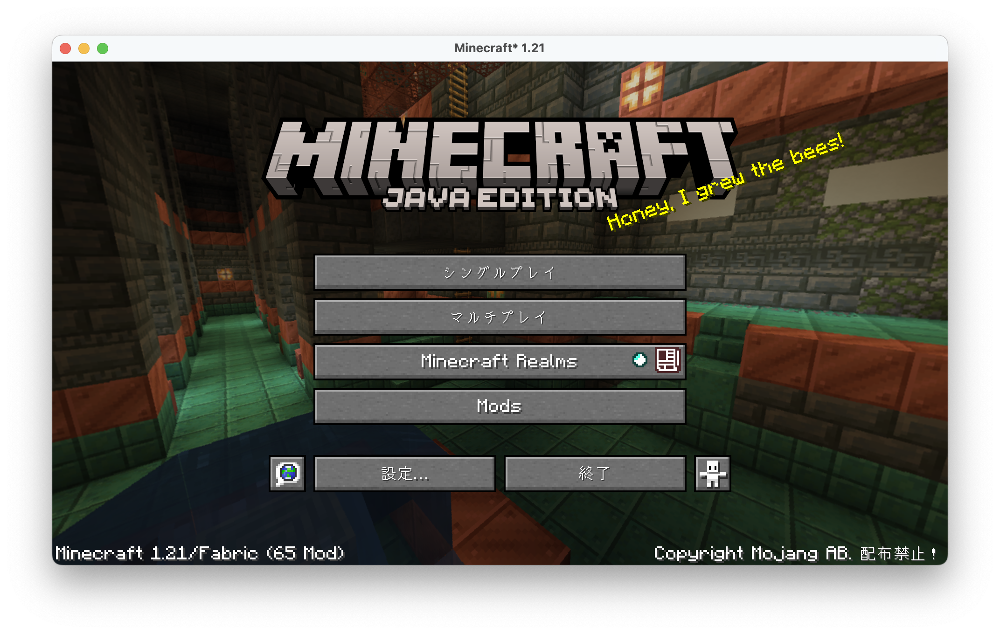
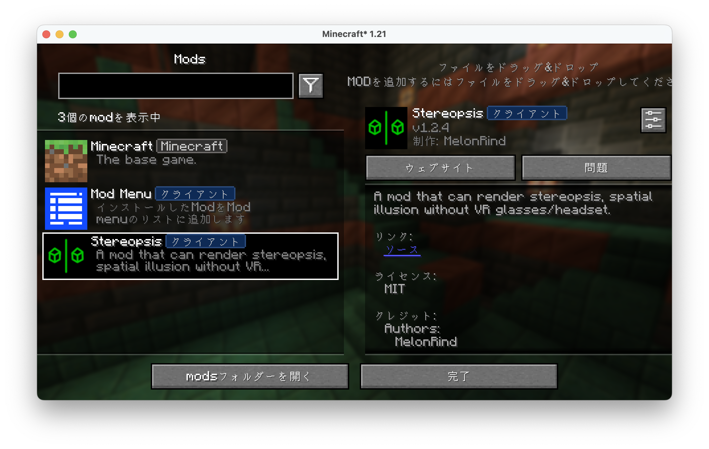
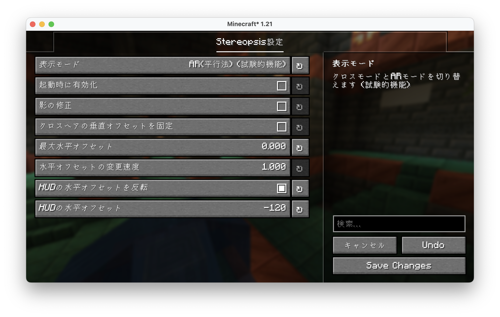
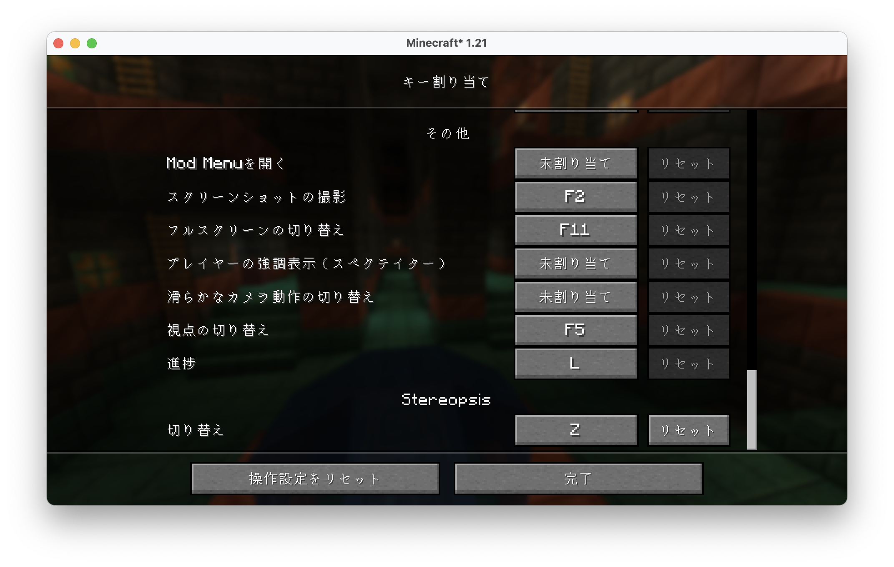
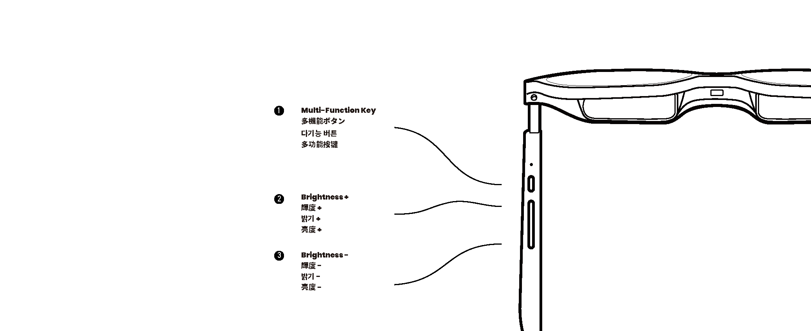

## はじめに

皆さんは、XREAL Airというメガネ型のXRデバイスをご存知でしょうか。  
このデバイスは、ゲーム機やMacなどを繋いで、NetflixやAmazon Prime Videoなどの映像を見ることができたり、ゲームを遊ぶことができます。

今回は、このXREAL Airを使って、Minecraftを遊ぶ方法を紹介します。

## 必要なもの

- DP Altモードに対応したPCまたは[Mac](https://mac.com/)
- [XREAL Air](https://www.xreal.com/jp/air)  
  今回は、[XREAL Air 2 Pro](https://www.xreal.com/jp/air2)を使用します。
- [Minecraft Java Edition](https://www.minecraft.net/ja-jp/store/minecraft-java-edition)

## 手順

### Modの導入

あらかじめ、[Fabric](https://fabricmc.net/)というModローダーを導入しておきます。

Fabricが導入できたら、以下のModを導入します。

- [Fabric API](https://modrinth.com/mod/fabric-api) - 前提Mod
- [Stereopsis](https://modrinth.com/mod/stereopsis) - ステレオ表示を行うためのMod  
  必ず、バージョン1.2.4以上のものを導入してください。  
  XREAL Airにバージョン1.2.4で対応させました。(私がmodをmod! ...なんちゃって)
- [Mod Menu](https://modrinth.com/mod/modmenu) - 設定画面を開くためのMod
- [Text Placeholder API](https://modrinth.com/mod/placeholder-api) - Mod Menuの依存Mod
- [YetAnotherConfigLib](https://modrinth.com/mod/yacl) - Stereopsisの依存Mod

### Minecraftの起動

#### Stereopsisの設定

Minecraftを起動し、Mod Menuを開きます。

Mod Menuの画面が開いたら、Stereopsisの設定を変更します。

Stereopsisの設定画面が開いたら、以下の設定を行います。

- **表示モード**: AR(平行法)
- **最大水平オフセット**: 0.0
- **HUDの水平オフセットを反転**: はい
- **HUDの水平オフセット**: -120

設定が完了したら、[Save Changes]を押して、設定を閉じます。

#### キー割り当ての変更

次に、キー割り当てを変更します。

設定... > 操作設定... > キー割り当て... から、Stereopsisのキー割り当てを変更します。

お勧めは、Zキーです。

### XREAL Airとの接続

XREAL AirをPCまたはMacに接続します。

接続ができたら、XREAL Airの輝度+ボタンを長押しして、立体視映像モードに切り替えます。

### Minecraftのプレイ

ゲームを開始すると、通常の画面で表示されます。

フルスクリーンにして、XREAL Airを装着します。

XREAL Airを装着したら、上で設定したキー(ここではZキー)を押して、Stereopsisの表示モードを切り替えます。

これで、Minecraftを立体視で楽しむことができます。

## おわりに

今回は、XREAL Airを使って、Minecraftを遊ぶ方法を紹介しました。

立体視でMinecraftを遊ぶと、より没入感が増し、新しい体験ができるかもしれません。

ぜひ、お試しください!
