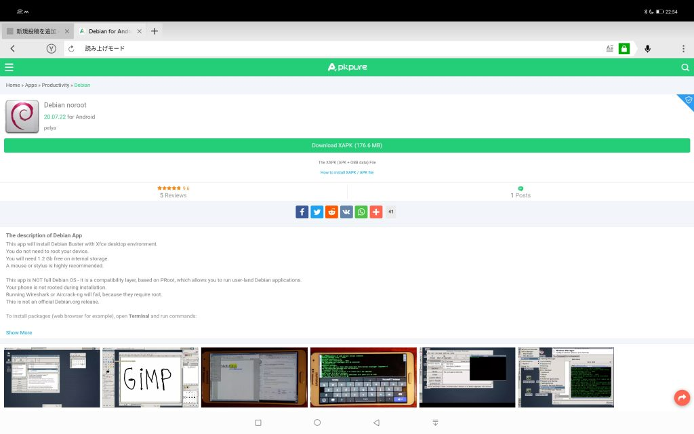
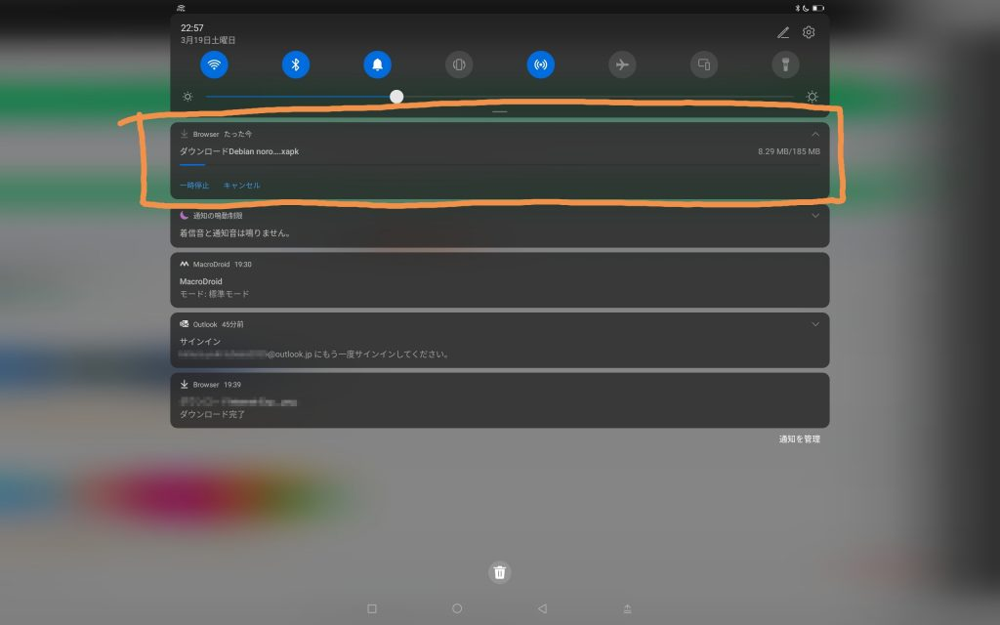
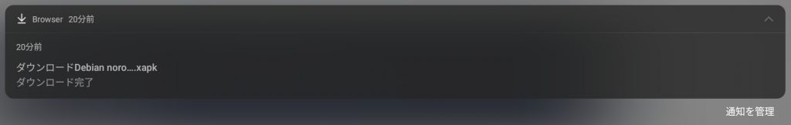
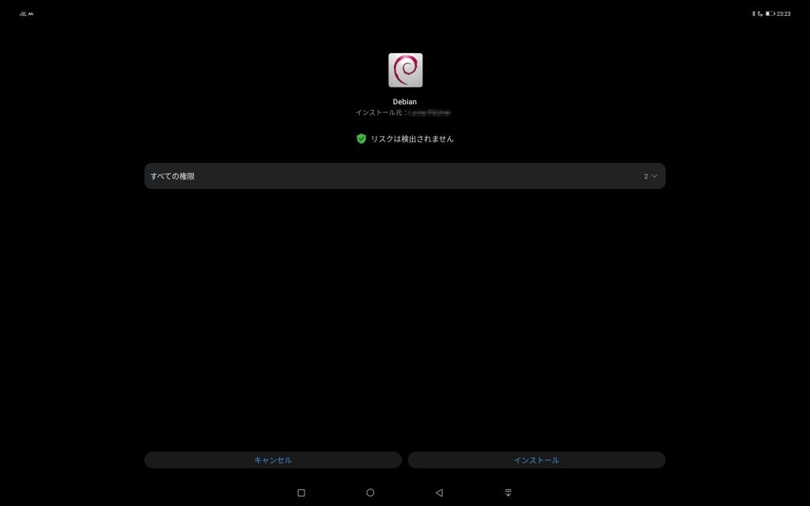
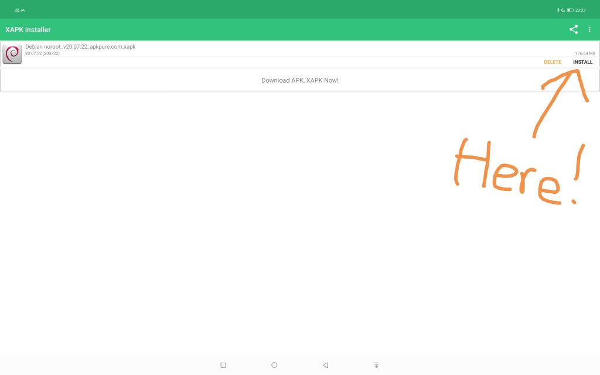
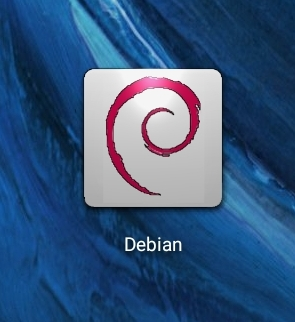
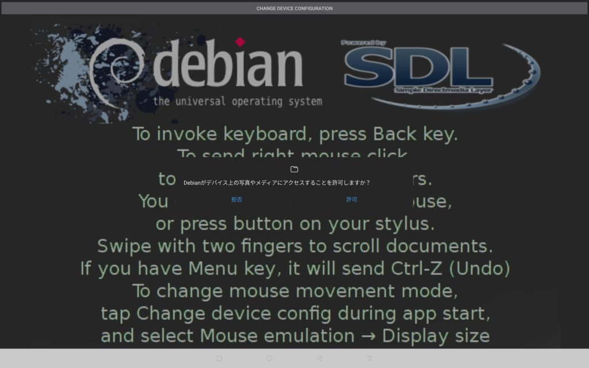
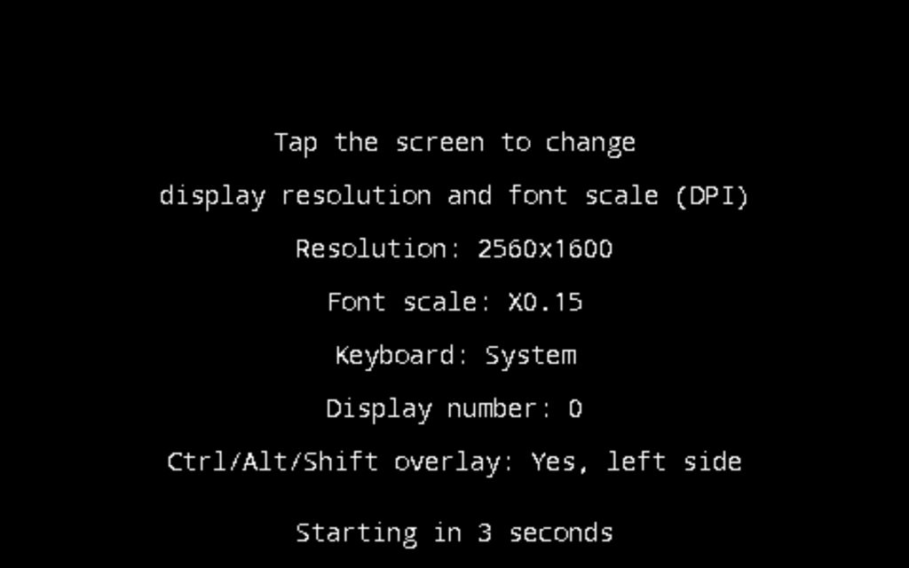

## 1 はじめまして！

今日から、RenorariBlogにて新しくライターとして頑張らせていただきます！
モズベクのオレオォと申します。低頻度での投稿となりますが、よろしくお願いします！

## 2 まずは下準備から

さて、今回のBlogの本題「AndroidでLinuxアプリを動かす」ために必要な下準備（２ステップ）があります。
非常に簡単なのですぐ終わります！

・ Debianアプリをインストール
・ 発行元不明のアプリのインストールを許可

Google Playストアからは削除されているようなので、下記のリンクを使用し、ApkPureからダウンロードできます。
[https://m.apkpure.com/debian-noroot/com.cuntubuntu](https://m.apkpure.com/debian-noroot/com.cuntubuntu)

はい、このような画面が出た人は正解です。
※これはタブレットからの表示なのでスマホからの表示は少し違う可能性がありますが、似ているような画面が出たらOKです。

画像: ApkPureを使用してDebianアプリの詳細を表示している。(撮影: オレオォ)

真ん中らへんにある黄緑のボタン、「Download XAPK」をクリックしましょう。するとなんかダウンロードされます。

画像: 通知バーに表示されるダウンロード通知。(撮影: オレオォ)

はい、少し回線の状況によってはダウンロードに時間がかかることがありますが、ダウンロードできていますね！
ダウンロードが完了したら、ファイルを開きたいですけど...ちょっと待って！焦りは禁物です。

お使いの端末は、XAPKをサポートしていますか？僕の端末はサポートしていますが、対応してない端末の方が多いと思います。
その場合はGoogleかBingか何かで「XAPK Installer」と調べてください。XAPKをインストールするために必要なアプリをインストールできます。

## ３ インストールしてみよう

インストールを始めましょう。XAPK対応のデバイスを使用している方は通知バーから、XAPK非対応のデバイスを使用している方はXAPKInstallerからインストールしましょう。

・ XAPK対応機種の場合

通知バーにある通知を押すとインストールが開始されます。もし、「不明な提供元からのインストールを許可」という画面が出た場合はその項目をオンにしましょう。インストール完了後はオフにすることをオススメします。

画像: 通知バーに表示されるダウンロード完了の通知。(撮影: オレオォ)

この通知をタップするだけでインストールできます。

画像: インストール許可の確認。(撮影: オレオォ)

ここまで来ればインストールするだけです。難なし。

・ XAPK非対応の機種の場合

XAPKInstallerを開きましょう。あとは、Installを押すだけです。その後は対応機種と一緒です。easy。

画像: XAPKInstallerのインストール画面。(撮影: オレオォ)

## ４ セットアップしよう

画像: インストールされたDebianアプリ。(撮影: オレオォ)

Debianアプリを起動しましょう。ファイルへのアクセス権を要求されます。素直に許可しましょう。

画像: アクセス権の要求。(撮影: オレオォ)

こんな画面が出てきても決して触らない。後々めんどくさいことになるんで。

画像: ディスプレイの詳細の確認。(撮影: オレオォ)

しばらく待っているとなんかハッカーみたいな格好良さげなターミナル画面がぶわーって出て来ます。
その画面が切り替わると、XCFEが立ち上がりました！そこに自分のアプリを入れるなりして自分なりにカスタマイズしてみてください！

最後まで見てくれてありがとうございました。
作成: オレオォ
