皆さんは、「手元にあるAviUtlだけで簡単にコラ画像作れたらな～」って思いませんか?
実は、できるんです!

## 実行環境

<table><tbody><tr><th>Windows</th><td>バージョン 21H2</td></tr><tr><th>AviUtl</th><td>version 1.10</td></tr><tr><th>拡張編集</th><td>version 0.92</td></tr></tbody></table>

## 元画像

まず、元画像を読み込みましょう

今回の画材はこれです!

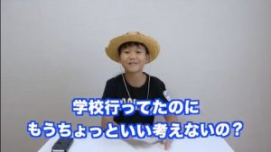

この画像の「学校」の部分を「幼稚園」に変えてみたいと思います!

## 完成品

先ほど見てもらった元画像が

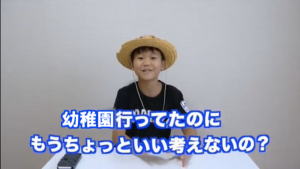

このように違和感無く文字が置き換わっています!

## AviUtlに読み込み

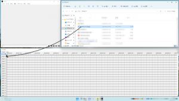

画像を拡張編集のLayer1にドラック&ドロップ

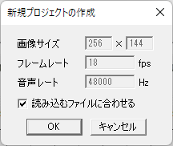

「読み込むファイルに合わせる」にチェックを入れ、
「OK」を押す

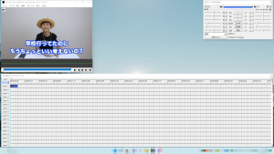

このようになる

## 文字を消す

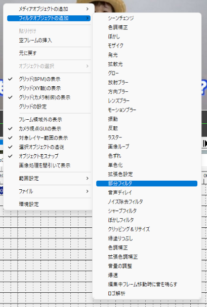

拡張編集のウインドウを右クリックし、
「フィルタオブジェクトの追加」> 「部分フィルタ」を追加

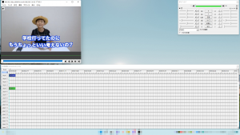

このようになる(画像に変化なし)

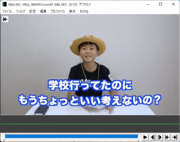

「学校」という文字に位置とサイズなどを合わせておきます。

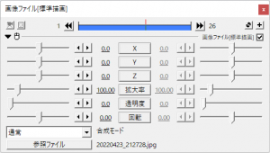

を押して、「ぼかし」を追加

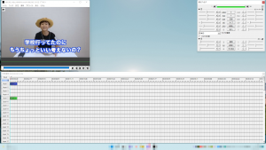

このようになる

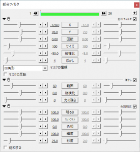

各パラメータを調整してください。
(色調補正は任意)

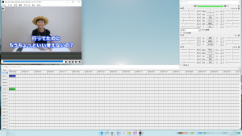

## 文字追加

拡張編集のウインドウを右クリックし、「メディアオブジェクトの追加」 > 「テキスト」を追加

位置、サイズ、フォントやスタイルなどを合わせたら、

## 完成

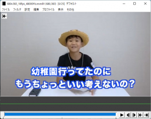

完成しました!

PNG出力プラグイン等を入れ、出力すると簡単に出力できるので試してみてくださいね!
