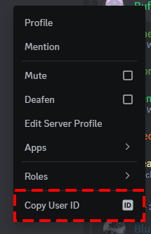
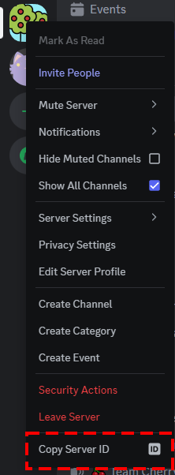
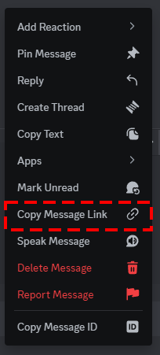
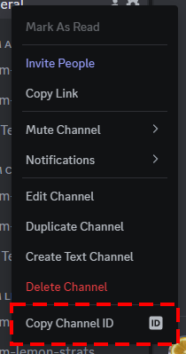

ユーザー、サーバー、メッセージなどには一意的に割り当てられる ID 番号があります。  
この ID 番号を知らなくても、Discord を使う上では問題ありませんが、多くの場面で ID が必要になることがあります。

この記事では、デスクトップ版の Discord で、ID をコピーする方法を紹介します。

モバイル版のDiscordでIDをコピーする方法は、[モバイル版DiscordでIDをコピーする方法](/blog/モバイル版discordのIDをコピーする方法/)をご覧ください。

## 開発者モードを有効にする

ID 番号をコピーできるようにするには、開発者モードを有効にする必要があります。  
その方法は次のとおりです。

1. デスクトップ アプリの左下隅にある[歯車アイコン]を押して、ユーザー設定を開きます。
2. [詳細設定]に進みます。
3. [開発者モード]の横にあるトグルスイッチを押して、有効にします。  
   スイッチのチェックマークは有効になっていることを示し、バツマークは無効になっていることを示します。

## ユーザー ID をコピーする

ユーザー ID は、サーバーやグループチャット、DM でコピーできます。

1. ID を貼り付けたい場所をあらかじめ開いておきます。
2. 次に、ユーザーを右クリックして、[ユーザー ID をコピー]を押します。
3. コピーができたら、貼り付けたい場所にペーストできます。

## サーバー ID をコピーする

1. ID を貼り付けたい場所をあらかじめ開いておきます。
2. サーバーアイコンを右クリックして、[サーバー ID をコピー]を押します。
3. コピーができたら、貼り付けたい場所にペーストできます。

## メッセージリンクをコピーする

メッセージリンクを使用すると、特定のメッセージにジャンプできます。

また、同じ手順でメッセージ ID をコピーすることもできます。

1. リンクを貼り付けたい場所をあらかじめ開いておきます。
2. メッセージを右クリックして、[メッセージリンクをコピー]を押します。
3. コピーができたら、貼り付けたい場所にペーストできます。  
   このリンクをクリックすると、そのメッセージにジャンプすることができます。

## チャンネル ID をコピーする

チャンネル ID をコピーし、`<#チャンネルID>`と入力することで、クリック可能なリンクを送信できます。

また、同じ手順でグループチャットのチャンネル ID をコピーすることもできます。

1. ID を貼り付けたい場所をあらかじめ開いておきます。
2. チャンネルを右クリックして、[チャンネル ID をコピー]を押します。
3. コピーができたら、貼り付けたい場所にペーストできます。

## 終わりに

以上が、デスクトップ版の Discord で ID をコピーする方法です。

ID 番号は、通常の使用では必要ない情報ですが、サポートや問題解決の際には重要な情報となります。  
必要に応じて、この方法を活用してくださいね!

それでは、楽しい Discord ライフをお過ごしください!
