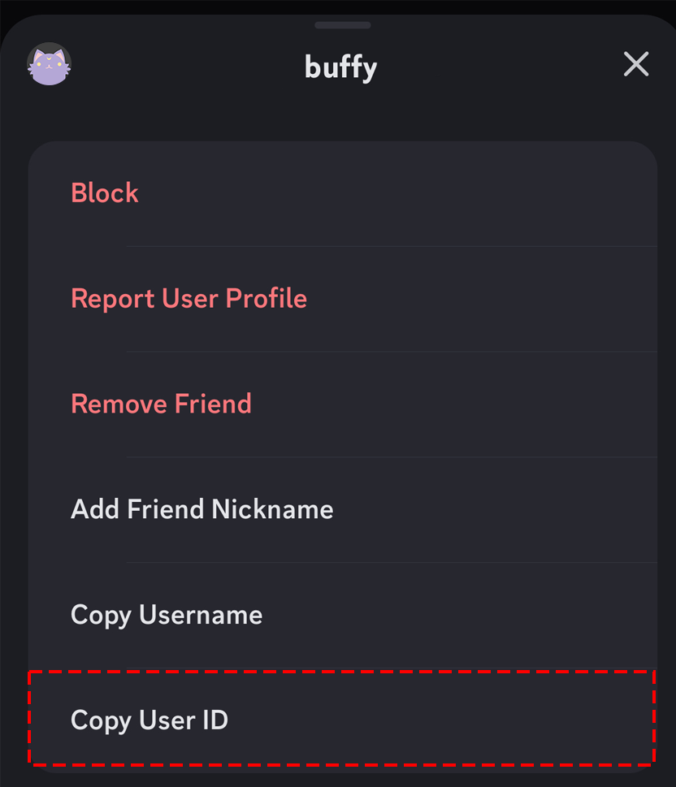
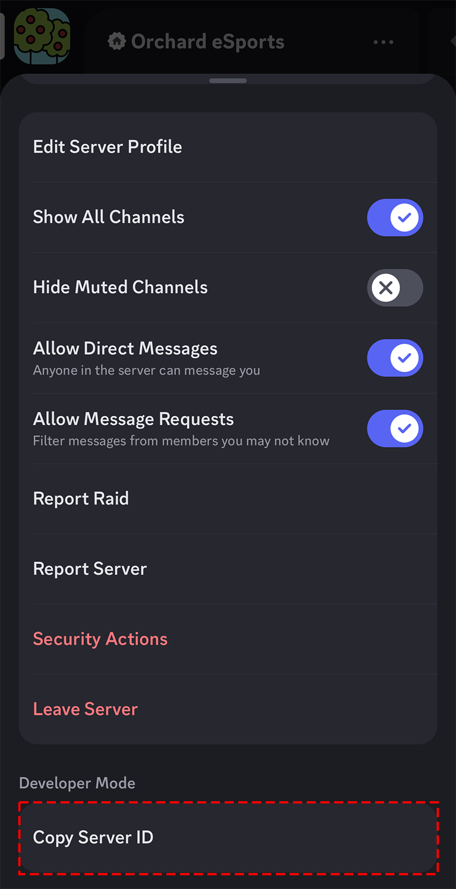
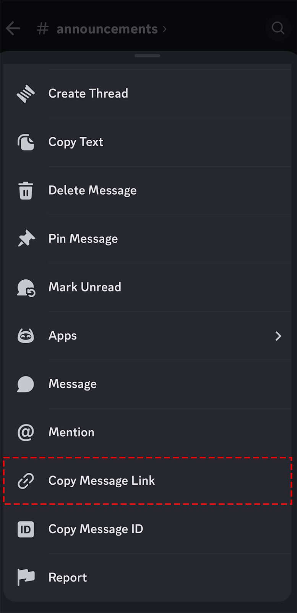
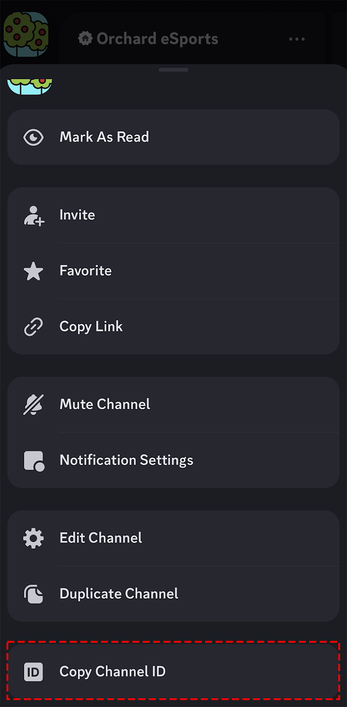

ユーザー、サーバー、メッセージなどには一意的に割り当てられる ID 番号があります。  
この ID 番号を知らなくても、Discord を使う上では問題ありませんが、多くの場面で ID が必要になることがあります。

この記事では、モバイル版の Discord で、ID をコピーする方法を紹介します。

デスクトップ版の Discord で ID をコピーする方法は、[デスクトップ版 Discord で ID をコピーする方法](/blog/デスクトップ版discordのIDをコピーする方法/)をご覧ください。

## 開発者モードを有効にする

ID 番号をコピーできるようにするには、開発者モードを有効にする必要があります。  
その方法は次のとおりです。

1. 右下隅にある[アバター]をタップします。
2. 次に、右上隅にある[歯車アイコン]をタップします。
3. ここで、[アプリ設定]

## ユーザー ID をコピーする

ユーザー ID は、サーバーやグループチャット、DM でコピーできます。

1. ID を貼り付けたい場所をあらかじめ開いておきます。
2. ユーザーをタップし、右上の点々(…)をタップします。
3. 次に、[ユーザー ID をコピー]をタップします。
4. コピーができたら、貼り付けたい場所にペーストができます。

## サーバー ID をコピーする

1. ID を貼り付けたい場所をあらかじめ開いておきます。
2. サーバー名の次の点々(…)をタップします。
3. [サーバーIDをコピー]のボタンが見えるまでスクロールし、タップします。
4. コピーができたら、貼り付けたい場所にペーストができます。

## メッセージリンクをコピーする

メッセージリンクを使用すると、特定のメッセージにジャンプできます。

また、同じ手順でメッセージ ID をコピーすることもできます。

1. リンクを貼り付けたい場所をあらかじめ開いておきます。
2. メッセージをメニューが表示されるまで長押しします。
3. [メッセージリンクをコピー]のボタンが見えるまでスクロールし、タップします。
4. コピーができたら、貼り付けたい場所にペーストできます。  
   このリンクをクリックすると、そのメッセージにジャンプすることができます。

## チャンネル ID をコピーする

チャンネル ID をコピーし、`<#チャンネルID>`と入力することで、クリック可能なリンクを送信できます。

また、同じ手順でグループチャットのチャンネル ID をコピーすることもできます。

1. ID を貼り付けたい場所をあらかじめ開いておきます。
2. チャンネルをメニューが表示されるまで長押しします。
3. 次に、[チャンネルIDをコピー]のボタンが見えるまでスクロールします。
4. コピーができたら、貼り付けたい場所にペーストできます。

## 終わりに

以上が、モバイル版の Discord で ID をコピーする方法です。

ID 番号は、通常の使用では必要ない情報ですが、サポートや問題解決の際には重要な情報となります。  
必要に応じて、この方法を活用してくださいね!

それでは、楽しい Discord ライフをお過ごしください!
