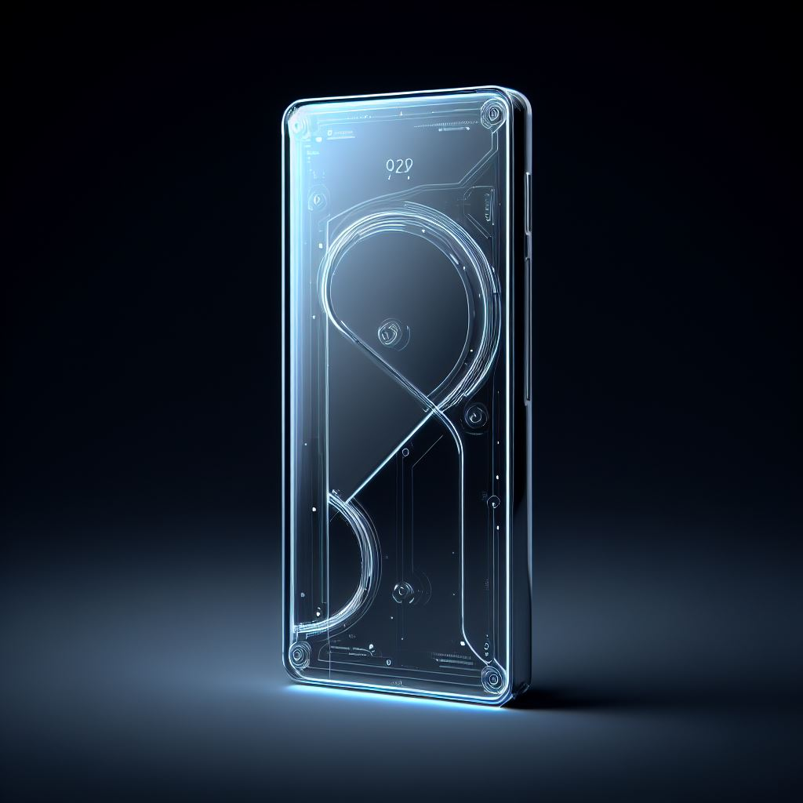
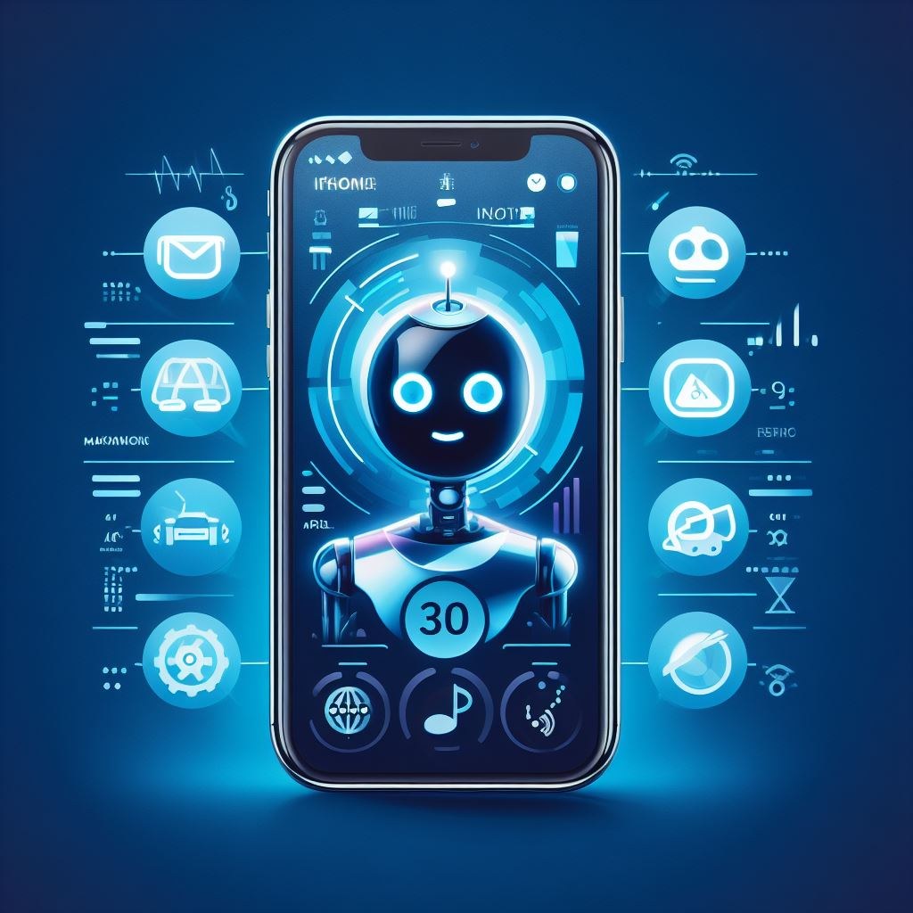
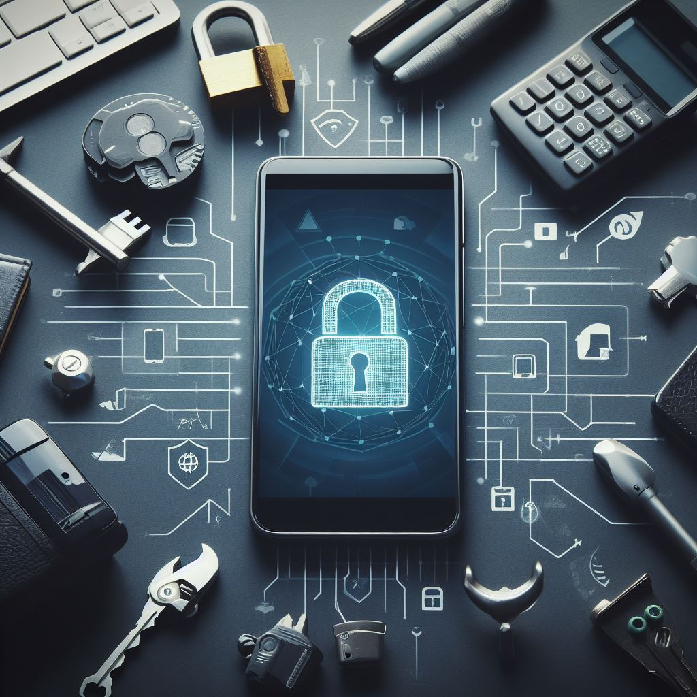
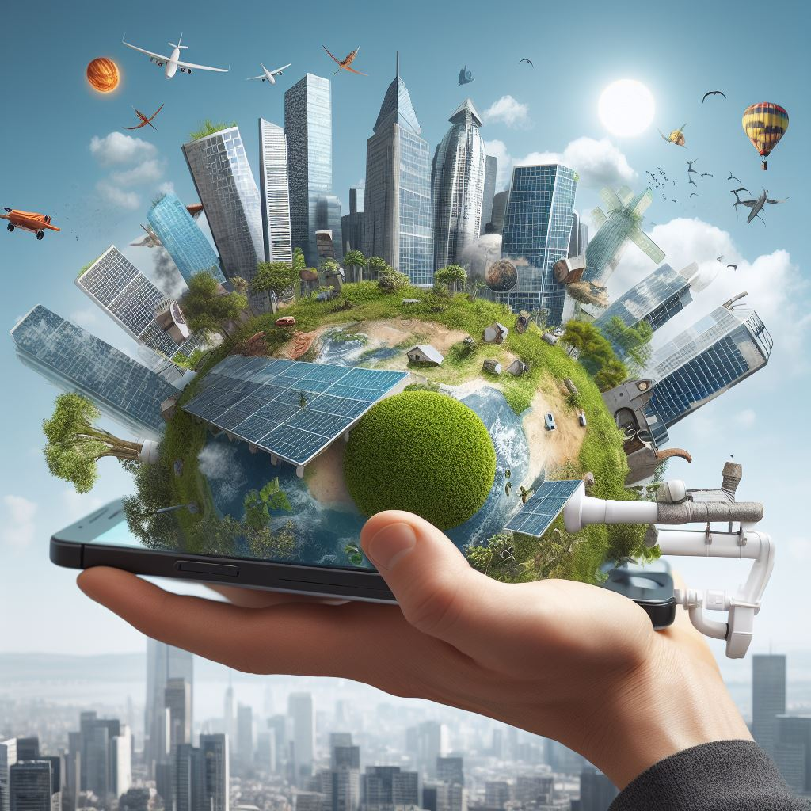
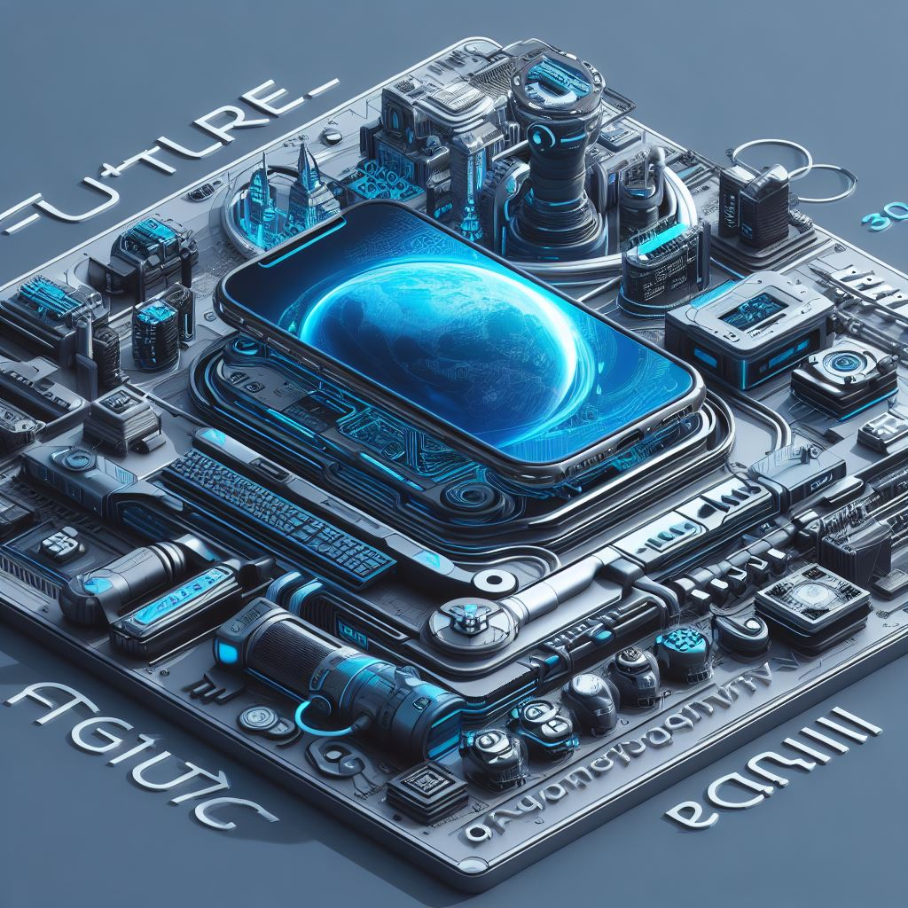
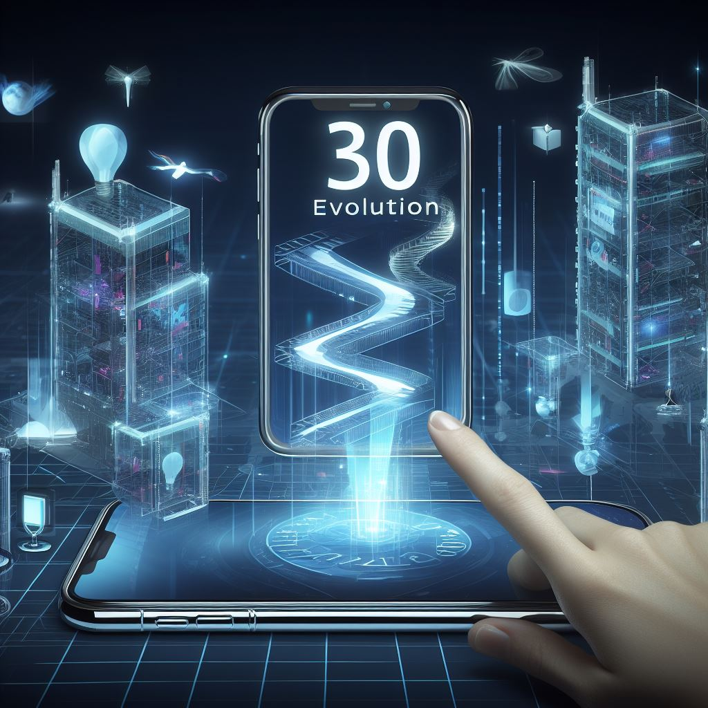

## 第1章: 未来のデザイン

iPhone 30は、未来のテクノロジーとデザインの融合です。  
驚くほど薄く、軽量で透明な素材で作られたガラスと金属のユニボディデザインは、美的価値に優れ、使い勝手も向上しています。  
光の屈折によって、異なる色やパターンがデバイスの表面を照らし出し、それはまるで未来の宝石のようです。  

## 第2章: フレキシブルなディスプレイ

iPhone 30のディスプレイは、フレキシブルで透明な素材から作られており、ユーザーは画面を自由に曲げ、拡大縮小することができます。  
これにより、情報の操作が直感的かつ革新的に行えます。  
また、AR（拡張現実）体験が非常に進化し、現実とデジタルの境界がますます曖昧になります。  

## 第3章: AIとの共存

iPhone 30は、AI（人工知能）の力を最大限に活用します。  
Siriの進化版は、ユーザーの行動や好みを学び、個別にカスタマイズされたアシスタントを提供します。  
AIは、私たちの日常生活において、情報の整理、タスクの自動化、学習の支援など、さまざまな面でサポートを提供します。  

## 第4章: 安全性とプライバシー

iPhone 30は、最高水準のセキュリティとプライバシー保護を提供します。  
顔認識や指紋認証技術がさらに洗練され、個人情報の保護が徹底されます。  
ユーザーは完全なコントロールを持ち、データの共有や追跡を管理できます。  

## 第5章: グリーンテクノロジー

未来のiPhoneは、環境への配慮が強調されたデバイスです。  
太陽光発電パネルがデバイスを充電し、持続可能な素材とリサイクル可能なコンポーネントが使用されています。  
Appleは環境保護に積極的に貢献し、地球に優しいテクノロジーを提供します。  

## 第6章: 未来への窓

iPhone 30は、未来のデジタル世界への窓です。  
AR、VR、および拡張現実を駆使して、仮想空間と現実空間をシームレスに統合し、新たなエンターテインメントやコミュニケーションの形が生まれます。  
未来のiPhoneは、私たちの生活をより豊かで魅力的なものに変えることでしょう。  

## 結論

未来のiPhone 30は、デザイン、技術、セキュリティ、環境への配慮の点で進化し、私たちのデジタルライフを革新的な方法で向上させるでしょう。  
未来に向けてのこの興奮に満ちた展望が、私たちの日常をより魅力的で効率的にする新しいデジタルコンパニオンを待ち望むことを許してください。  

## あとがき

この記事は、ChatGPTとGitHub CopilotとBing AIを使って書かれました。  
事実に基づかない部分があるかもしれませんが、ご了承ください。  
