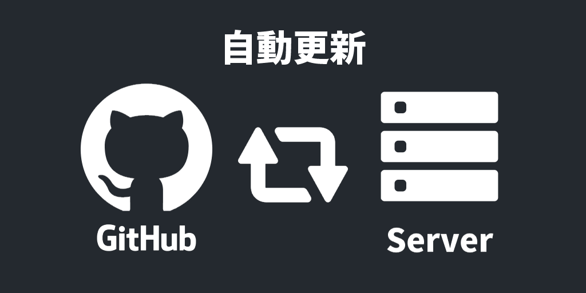
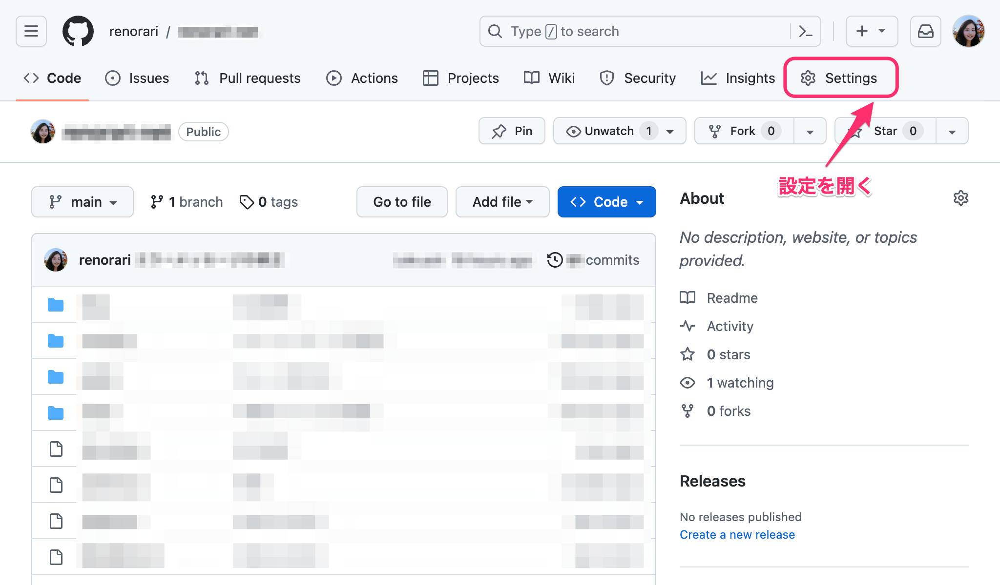
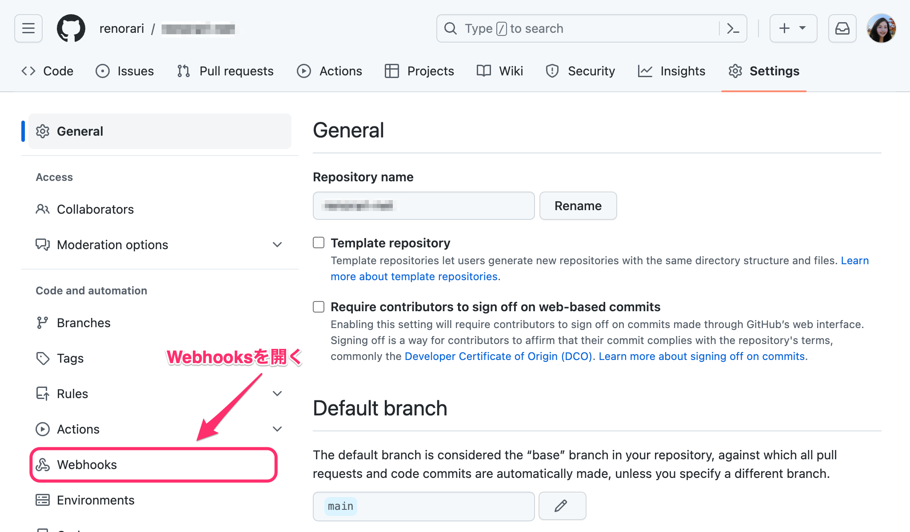
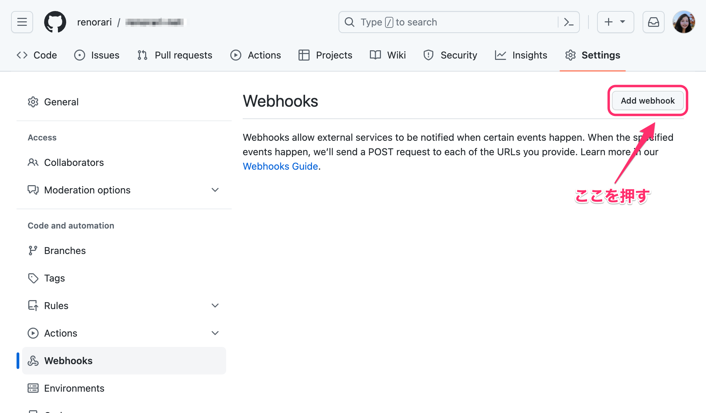
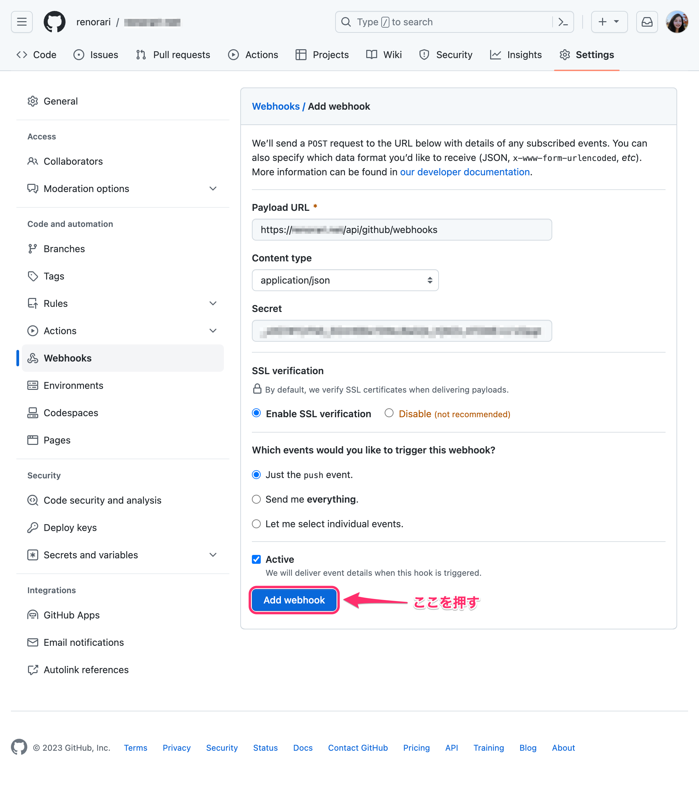

## はじめに

### 前提条件

- NodeJSを使っている
- npmを使っている
- GitHubに直で本番環境用のデータ置いている
- NodeJSを使ってWebサーバーを立てている

人向けの記事です。

### なぜ自動更新するのか

手動でgit pullって面倒ですよね...?

どうせなら、git pushをしたら自動で更新されるようにしたいですよね...?

ということです。

## NodeJSでWebサーバーを建てて、GitHubからのWebhookを受け取る

### Webサーバーを建てる

まず、Webサーバーを建てます。

ここでは、Expressを使ってWebサーバーを建てます。

初めに、Expressをインストールします。

```bash
npm install express
```

次はプログラムを書きます。

```js
const express = require("express");
const app = express();
const port = 3000;

app.get("/", function (req, res) {
  res.send("Hello World!");
});

app.listen(port, function () {
  console.log(`Example app listening on port ${port}!`);
});
```

これで、Webサーバーが建てられました。

### GitHubからのWebhookを受け取る

次に、GitHubからのWebhookを受け取ります。

まず、GitHubからのWebhookを受け取るために、@octokit/webhooksをインストールします。

```bash
npm install @octokit/webhooks
```

次に、先ほどのプログラムに、GitHubからのWebhookを受け取るためのコードを追加します。

```js
const express = require("express");
const app = express();
const port = 3000;


/* ここから追加 */

const { Webhooks, createNodeMiddleware } = require("@octokit/webhooks");
const webhooks = new Webhooks({
  secret: "mysecret" // パスワードみたいなもの
});

webhooks.on("push", ({ id, name, payload }) => {
  console.log("Received push event", name, "to", payload.ref);
});

app.use(createNodeMiddleware(webhooks));

/* ここまで追加 */


app.get("/", function (req, res) {
  res.send("Hello World!");
});

app.listen(port, function () {
  console.log(`Example app listening on port ${port}!`);
});
```

これで、GitHubからのWebhookを受け取る準備ができました。

## GitHubのWebhookを設定する

次に、GitHubのWebhookを設定します。

まず、GitHubのリポジトリの設定画面に行きます。


次に、Webhooksを開きます。


次に、Add webhookをクリックします。


赤い線で囲まれているところを入力します。


Payload URLには、WebサーバーのURLと`/api/github/webhook`を入力します。

Content typeには、`application/json`を選択します。

Secretには、先ほどのプログラムで設定した`mysecret`を入力します。

最後に、Add webhookをクリックします。


これで、GitHubのWebhookの設定が完了しました。

## Webhookを受け取る

次に、Webhookでpushを受け取ったときに、git pullなどをするようにします。

まず、先ほどのプログラムに、git pullをするコードを追加します。

```js

/* ここから追加① */
const { execSync } = require("child_process");
/* ここまで追加① */

const express = require("express");
const app = express();
const port = 3000;
const { Webhooks, createNodeMiddleware } = require("@octokit/webhooks");
const webhooks = new Webhooks({
  secret: "mysecret"
});

webhooks.on("push", ({ id, name, payload }) => {
  console.log("Received push event", name, "to", payload.ref);


  /* ここから追加② */
  execSync("git pull");
  execSync("npm install");
  process.exit(); // プログラムを終了(Systemdなどで再起動するため)
  /* ここまで追加② */

});

app.use(createNodeMiddleware(webhooks));

app.get("/", function (req, res) {
  res.send("Hello World!");
});

app.listen(port, function () {
  console.log(`Example app listening on port ${port}!`);
});
```

これで、Webhookでpushを受け取ったときに、git pullなどをするようになりました。

## おわりに

いかがでしたか？

これで、GitHubにpushしたら自動で更新されるようになりました。

これからも、このような技術系の記事や、それ以外の記事を書いていきますので、よろしくお願いします。

## 参考

- [Express/Node の紹介 - ウェブ開発を学ぶ | MDN](https://developer.mozilla.org/ja/docs/Learn/Server-side/Express_Nodejs/Introduction#helloworld_express)
- [webhook について - GitHub Docs](https://docs.github.com/ja/developers/webhooks-and-events/webhooks/about-webhooks)
- [octokit/webhooks.js: GitHub webhook events toolset for Node.js](https://github.com/octokit/webhooks.js#readme)
