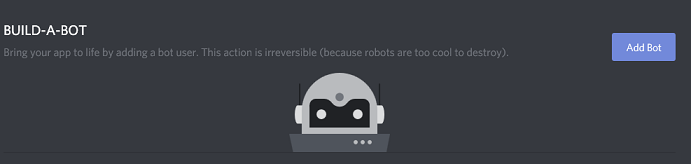
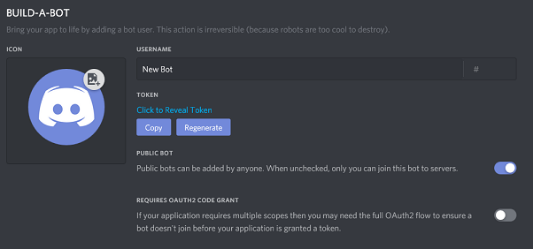
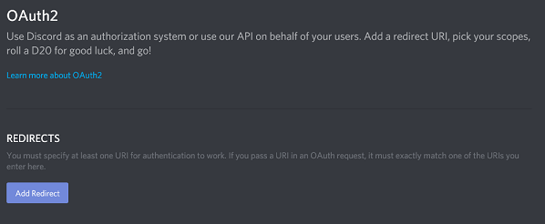
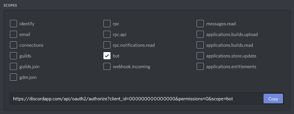
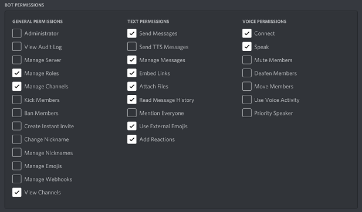

## Botアカウント作成

Discord APIを使用するには、BotのDiscordアカウントを用意する必要があります。

Botのアカウント作成はとても簡単です。

以下の手順に従って、Botアカウントを作成してください。

### [DiscordのWebサイト](https://discord.com/)にログインしていることを確認してください。

### [アプリケーションページ](https://discord.com/developers/applications)に移動します。(このページは英語です。)

### 「New Application」ボタンをクリックします。

### アプリケーションの名前を決めて、「Create」をクリックします。

### 「Bot」タブへ移動し、「Add Bot」をクリックしてBotユーザーを作成します。

「Yes, do it!」をクリックして続行します。

### 他人にBotの招待を許可する場合には、 Public Bot にチェックを入れてください。

また、必要なサービスを開発している場合を除いて、 Require OAuth2 Code Grant がオフになっていることを確認する必要があります。わからない場合は チェックを外してください。

### 「Copy」ボタンを使ってトークンをコピーします。

> このトークンは、あなたのBotのパスワードと同義であることを覚えておきましょう。 誰か他の人とトークンを共有することは絶対に避けてください。 トークンがあれば、誰かがあなたのBotにログインし、サーバーから退出したり、サーバー内のすべてのメンバーをBANしたり、すべての人にメンションを送るなどといった悪質な行為を行える様になってしまいます。 可能性は無限にあるので、絶対に トークンを共有しないでください。 誤ってトークンを流出させてしまった場合、可能な限り速急に「Regenerate」ボタンをクリックしましょう。 これによって古いトークンが無効になり、新しいトークンが再生成されます。今度からは新しいトークンを利用してログインを行う必要があります。

### 以上です。 これでボットアカウントが作成され、そのトークンでログインできます。

## Botを招待

Botのユーザーを作成しましたが、現時点ではどのサーバーにも参加していない状態です。

Botを招待したい場合は、そのための招待URLを作成する必要があります。

DiscordのWebサイトにログインしていることを確認してください。

### [アプリケーションページ](https://discord.com/developers/applications)に移動します。(このページは英語です。)

### Botのページを開きます。

### 「OAuth2」タブへ移動します。

### 「scopes」下にある「bot」チェックボックスを選択してください。

### 「Bot Permissions」からBotの機能に必要な権限を選択してください。

Botに「管理者」権限を要求させることによる影響は認識しておきましょう。

ボットの所有者は、サーバー全体に二段階認証が有効になっているサーバーに追加する場合、特定のアクションと権限に対して二段階認証を有効にする必要があります。詳細については、[二段階認証サポートページ](https://support.discord.com/hc/en-us/articles/219576828-Setting-up-Two-Factor-Authentication)を確認してください。

### 結果的に生成されたURLを使ってBotをサーバーに追加することができます。URLをコピーしてブラウザに貼り付け、Botを招待したいサーバーを選択した後、「認証」をクリックしてください。

## 終わりに

この記事で、DiscordBotのアカウント作成とBotの招待リンクの作成方法について解説しました。

もし、これでわからない場合は、コメントなどにぜひぜひご質問ください！！
